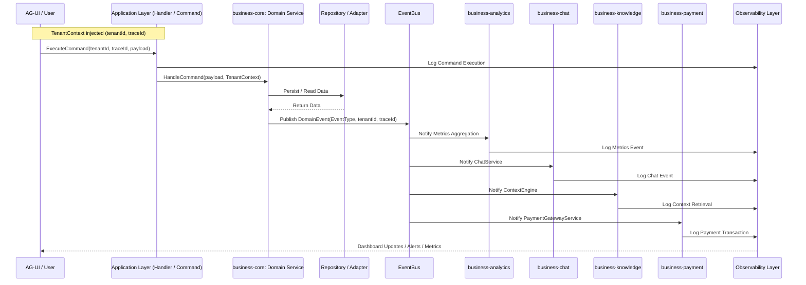

**versi sequence diagram lengkap** yang menggambarkan **flow per tenant** di SBA-Agentic, termasuk **command, domain, repository, EventBus, subscriber packages, dan observability**. Diagram ini bisa dijadikan blueprint interaktif implementasi.

---

---

### **Keterangan Sequence Diagram**

1. **Tenant Awareness**

   * Setiap layer menerima `tenantId` & `traceId` untuk isolasi dan traceability.
   * Semua event, logs, dan metrics dikaitkan dengan tenant.

2. **Command Execution**

   * User melalui AG-UI memicu `ExecuteCommand` atau `Query`.
   * Application layer dispatch ke handler, yang menjalankan domain service.

3. **Domain Layer**

   * Domain service melakukan proses bisnis.
   * Menyimpan/mengambil data dari repository.
   * Memublikasikan `DomainEvent` ke EventBus.

4. **EventBus**

   * Event async ke semua subscriber package (Analytics, Chat, Knowledge, Payment).
   * Menjaga flow multi-tenant.
   * Mendukung multi-adapter (InMemory, Redis, Kafka).

5. **Observability**

   * Logging dan metrics di setiap step.
   * Memberikan feedback ke dashboard AG-UI secara real-time.

6. **Feedback Loop**

   * Semua data observability, metrics, dan meta-events dikembalikan ke AG-UI.
   * Mendukung human-in-the-loop optimization.

---

### **Tambahan Technical Notes**

* Sequence ini berlaku **untuk setiap tenant**, sehingga setiap tenant memiliki context yang terisolasi.
* EventBus bersifat **publish/subscribe**, memungkinkan multiple subscriber mendengarkan event yang sama.
* Observability layer **menggabungkan logs, metrics, dan meta-events** dalam satu dashboard.

---

**versi diagram visual layer + sequence interaktif lengkap** dalam satu gambar yang menggabungkan **layered architecture + sequence per tenant**, sehingga lebih mudah dipakai sebagai **technical blueprint implementasi end-to-end** `.trae/documents/business/diagram%20visual%20layered%20-%20sequence%20interaktif%20lengkap.md`.

