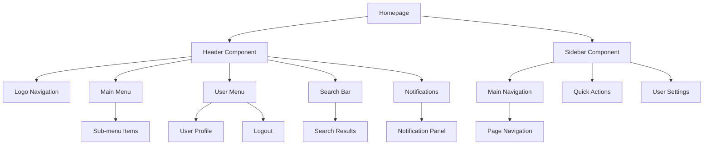

## 1. Product Overview

Proyek ini bertujuan untuk meredesain header dan sidebar aplikasi agar mencapai tampilan yang lebih harmonis dan terintegrasi dengan baik. Redesign ini fokus pada penerapan prinsip UI/UX terbaik, responsivitas, dan aksesibilitas untuk meningkatkan pengalaman pengguna secara keseluruhan.

Proyek ini akan memperbaiki navigasi yang intuitif, meningkatkan performa loading, dan memastikan kompatibilitas lintas perangkat dan browser untuk aplikasi web yang sudah ada.

## 2. Core Features

### 2.1 User Roles

| Role | Registration Method | Core Permissions |
|------|---------------------|------------------|
| Regular User | Email/SSO login | Akses ke dashboard, navigasi utama, dan fitur aplikasi |
| Admin User | Admin assignment | Akses penuh termasuk admin panel dan konfigurasi |
| Guest User | No registration | Akses terbatas ke halaman publik |

### 2.2 Feature Module

Redesign header dan sidebar ini terdiri dari modul-modul berikut:

1. **Header Component**: Logo aplikasi, navigasi utama, user menu, notifikasi, dan search bar
2. **Sidebar Navigation**: Menu navigasi utama, sub-menu, collapsible sections, dan quick actions
3. **Responsive Layout**: Breakpoint management untuk mobile, tablet, dan desktop
4. **Accessibility Features**: Keyboard navigation, screen reader support, dan high contrast mode
5. **Theme Integration**: Light/dark mode toggle dan consistent theming

### 2.3 Page Details

| Page Name | Module Name | Feature description |
|-----------|-------------|---------------------|
| Header Component | Logo Section | Menampilkan logo aplikasi dengan link ke homepage, ukuran responsif |
| Header Component | Navigation Menu | Menu horizontal utama dengan dropdown untuk sub-menu, highlight active page |
| Header Component | User Menu | Dropdown profil dengan user info, settings, dan logout option |
| Header Component | Notification Bell | Badge counter untuk unread notifications, dropdown panel untuk notification list |
| Header Component | Search Bar | Search input dengan autocomplete dan recent searches |
| Header Component | Theme Toggle | Switch untuk light/dark mode dengan smooth transition |
| Sidebar Component | Main Navigation | Vertical menu dengan icons dan labels, collapsible untuk mobile |
| Sidebar Component | Section Groups | Grouping menu berdasarkan kategori dengan expand/collapse functionality |
| Sidebar Component | Quick Actions | Shortcut buttons untuk actions yang sering digunakan |
| Sidebar Component | Footer Info | Version info dan status indicator di bagian bawah sidebar |
| Responsive System | Mobile Breakpoint | Hamburger menu untuk mobile, full screen overlay navigation |
| Responsive System | Tablet Breakpoint | Compact sidebar dengan icons only mode |
| Responsive System | Desktop Breakpoint | Full sidebar dengan labels dan expanded menu |
| Accessibility | Keyboard Navigation | Tab order, arrow keys navigation, dan escape key handling |
| Accessibility | Screen Reader | ARIA labels, live regions, dan semantic HTML structure |
| Accessibility | High Contrast | Mode dengan warna kontras tinggi untuk visibility yang lebih baik |

## 3. Core Process

### User Flow - Desktop Experience
1. User membuka aplikasi dan melihat header dengan logo, menu utama, dan user menu
2. Sidebar terlihat di samping kiri dengan menu navigasi yang terorganisir
3. User dapat navigate melalui header menu atau sidebar menu
4. Saat user scroll, header tetap visible (sticky) untuk akses yang mudah
5. User dapat collapse/expand sidebar sesuai preference

### User Flow - Mobile Experience
1. User melihat compact header dengan hamburger menu di mobile
2. Saat hamburger menu diklik, sidebar muncul sebagai overlay dari kiri
3. User dapat swipe untuk menutup sidebar atau klik overlay
4. Header menu items yang tidak muat akan masuk ke dalam hamburger menu
5. Search dan notification tetap accessible dari header

### User Flow - Accessibility Mode
1. User dapat navigate sepenuhnya menggunakan keyboard (Tab, Arrow keys, Enter)
2. Screen reader mengumumkan setiap perubahan state dan navigasi
3. High contrast mode tersedia untuk user dengan visual impairment
4. Focus indicators yang jelas untuk semua interactive elements

## 4. User Interface Design

### 4.1 Design Style

**Color Palette:**
- Primary: `hsl(var(--primary))` - Warna utama untuk header dan accent elements
- Secondary: `hsl(var(--secondary))` - Warna untuk sidebar background
- Background: `hsl(var(--background))` - Background utama
- Foreground: `hsl(var(--foreground))` - Warna teks utama
- Muted: `hsl(var(--muted))` - Warna untuk elements yang tidak aktif
- Accent: `hsl(var(--accent))` - Warna untuk hover states dan highlights

**Typography:**
- Font Family: System fonts (Inter, -apple-system, BlinkMacSystemFont)
- Header Font Size: 16px untuk desktop, 14px untuk mobile
- Sidebar Font Size: 14px untuk labels, 12px untuk descriptions
- Font Weight: 500 untuk active items, 400 untuk regular items

**Component Styles:**
- Border Radius: `var(--radius)` (8px default) untuk rounded corners
- Box Shadow: Subtle shadows untuk depth (header: 0 1px 3px rgba(0,0,0,0.1))
- Transitions: Smooth 200ms transitions untuk semua interactive elements
- Spacing: Consistent 8px grid system (8px, 16px, 24px, 32px)

**Icons:**
- Lucide React icons untuk consistency
- Size: 20px untuk header icons, 18px untuk sidebar icons
- Stroke Width: 2px untuk optimal visibility

### 4.2 Page Design Overview

| Page Name | Module Name | UI Elements |
|-----------|-------------|-------------|
| Header | Logo Section | Logo 32px height, clickable, hover effect dengan opacity change |
| Header | Navigation Menu | Horizontal layout, 40px height items, dropdown dengan 8px border radius |
| Header | User Menu | Avatar 32px, dropdown dengan 200px width, shadow elevation 2 |
| Header | Notification | Bell icon 20px, badge counter dengan red background, dropdown panel 320px width |
| Header | Search Bar | Input 240px width desktop, full width mobile, placeholder text, clear button |
| Sidebar | Main Menu | Vertical list, 40px height per item, icon 18px, 12px spacing |
| Sidebar | Section Headers | Bold text, 14px font size, uppercase tracking-wide, 16px padding |
| Sidebar | Collapse Button | Icon button 32px, positioned di bottom sidebar, tooltip on hover |
| Responsive | Mobile Overlay | Full viewport overlay, backdrop blur, slide animation 300ms |
| Responsive | Tablet Mode | Compact sidebar 64px width, icons only, tooltip untuk labels |

### 4.3 Responsiveness

**Desktop-First Approach:**
- Breakpoint XL: 1280px+ - Full layout dengan sidebar 256px width
- Breakpoint LG: 1024px - Sidebar 240px width, adjusted spacing
- Breakpoint MD: 768px - Sidebar 200px width, compact header
- Breakpoint SM: 640px - Hamburger menu, overlay sidebar
- Breakpoint XS: 320px - Mobile-optimized layout

**Touch Interaction Optimization:**
- Minimum touch target: 44px x 44px untuk semua interactive elements
- Swipe gestures untuk membuka/menutup sidebar di mobile
- Long press untuk context menus pada touch devices
- Increased spacing antara touch targets di mobile

**Performance Optimization:**
- Lazy loading untuk dropdown content
- CSS containment untuk isolate layout calculations
- Hardware acceleration untuk animations menggunakan transform
- Debounced resize handlers untuk optimal performance