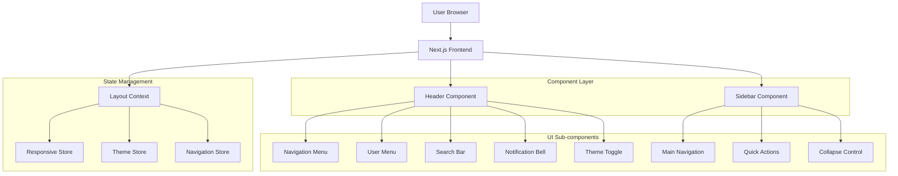
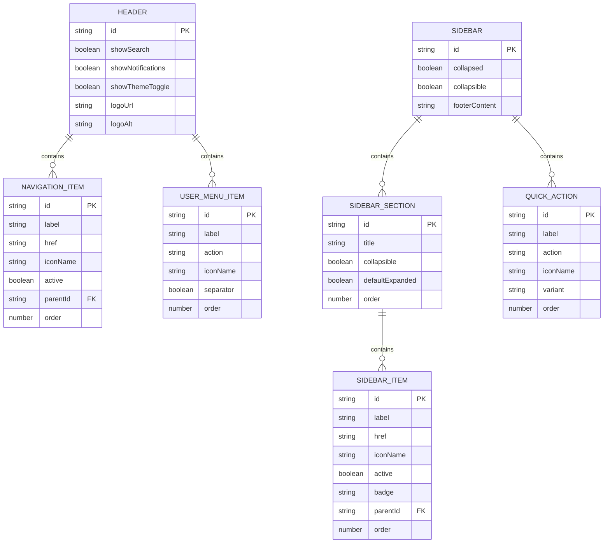

## 1. Architecture design



## 2. Technology Description

- Frontend: Next.js 15 + React 18 + TypeScript
- Styling: Tailwind CSS 3 + CSS Modules untuk component-specific styles
- State Management: Zustand untuk local state management
- Icons: Lucide React untuk consistent iconography
- Animation: Framer Motion untuk smooth transitions
- Accessibility: React Aria untuk accessible components
- Testing: Vitest + React Testing Library + jest-axe untuk a11y testing
- Initialization Tool: create-next-app
- Backend: None (frontend-only redesign)

## 3. Route definitions

| Route | Purpose |
|-------|---------|
| / | Homepage dengan header dan sidebar layout |
| /dashboard | Dashboard page dengan active navigation state |
| /agents | Agent management dengan sidebar navigation |
| /runs | Run history dengan filter dan search integration |
| /settings | User settings dengan collapsible sidebar |
| /login | Login page tanpa sidebar (standalone layout) |

## 4. Component Architecture

### 4.1 Core Component Types

**Header Component Interface:**
```typescript
interface HeaderProps {
  logo?: React.ReactNode;
  navigationItems: NavigationItem[];
  userMenuItems: UserMenuItem[];
  showSearch?: boolean;
  showNotifications?: boolean;
  showThemeToggle?: boolean;
  className?: string;
}

interface NavigationItem {
  label: string;
  href: string;
  icon?: React.ComponentType<{ className?: string }>;
  active?: boolean;
  children?: NavigationItem[];
}

interface UserMenuItem {
  label: string;
  onClick: () => void;
  icon?: React.ComponentType<{ className?: string }>;
  separator?: boolean;
}
```

**Sidebar Component Interface:**
```typescript
interface SidebarProps {
  sections: SidebarSection[];
  collapsed?: boolean;
  onCollapse?: (collapsed: boolean) => void;
  quickActions?: QuickAction[];
  footerContent?: React.ReactNode;
  className?: string;
}

interface SidebarSection {
  title: string;
  items: SidebarItem[];
  collapsible?: boolean;
  defaultExpanded?: boolean;
}

interface SidebarItem {
  label: string;
  href: string;
  icon: React.ComponentType<{ className?: string }>;
  active?: boolean;
  badge?: number | string;
  children?: SidebarItem[];
}

interface QuickAction {
  label: string;
  onClick: () => void;
  icon: React.ComponentType<{ className?: string }>;
  variant?: 'primary' | 'secondary' | 'ghost';
}
```

### 4.2 State Management

**Responsive Store:**
```typescript
interface ResponsiveStore {
  breakpoint: 'xs' | 'sm' | 'md' | 'lg' | 'xl';
  isMobile: boolean;
  isTablet: boolean;
  isDesktop: boolean;
  sidebarCollapsed: boolean;
  sidebarOpen: boolean;
  toggleSidebar: () => void;
  setSidebarCollapsed: (collapsed: boolean) => void;
  setBreakpoint: (breakpoint: string) => void;
}
```

**Theme Store:**
```typescript
interface ThemeStore {
  theme: 'light' | 'dark' | 'system';
  setTheme: (theme: 'light' | 'dark' | 'system') => void;
  toggleTheme: () => void;
}
```

**Navigation Store:**
```typescript
interface NavigationStore {
  activePath: string;
  setActivePath: (path: string) => void;
  navigationHistory: string[];
  addToHistory: (path: string) => void;
}
```

## 5. Server architecture diagram

Tidak ada backend architecture karena ini adalah frontend-only redesign. Semua state management dilakukan di client-side menggunakan Zustand stores.

## 6. Data model

### 6.1 Component State Model



### 6.2 CSS Custom Properties

```css
:root {
  /* Spacing */
  --header-height: 64px;
  --sidebar-width: 256px;
  --sidebar-width-collapsed: 64px;
  --spacing-xs: 4px;
  --spacing-sm: 8px;
  --spacing-md: 16px;
  --spacing-lg: 24px;
  --spacing-xl: 32px;
  
  /* Z-index */
  --z-header: 50;
  --z-sidebar: 40;
  --z-overlay: 30;
  --z-dropdown: 60;
  --z-tooltip: 70;
  
  /* Transitions */
  --transition-fast: 150ms ease-in-out;
  --transition-normal: 200ms ease-in-out;
  --transition-slow: 300ms ease-in-out;
  
  /* Breakpoints */
  --breakpoint-xs: 320px;
  --breakpoint-sm: 640px;
  --breakpoint-md: 768px;
  --breakpoint-lg: 1024px;
  --breakpoint-xl: 1280px;
}

@media (max-width: 768px) {
  :root {
    --header-height: 56px;
    --sidebar-width: 100vw;
  }
}
```

### 6.3 Accessibility Implementation

**ARIA Labels and Roles:**
```typescript
const headerAriaLabels = {
  mainNavigation: 'Main navigation',
  userMenu: 'User account menu',
  search: 'Search application',
  notifications: 'Notifications',
  themeToggle: 'Toggle dark mode',
  sidebarToggle: 'Toggle sidebar navigation'
};

const sidebarAriaLabels = {
  sidebarNavigation: 'Sidebar navigation',
  sectionTitle: (title: string) => `${title} section`,
  quickActions: 'Quick actions',
  collapseButton: 'Collapse sidebar'
};
```

**Keyboard Navigation:**
```typescript
const keyboardShortcuts = {
  toggleSidebar: ['Alt', 'S'],
  focusSearch: ['/', 'Ctrl+K'],
  navigateMenu: ['ArrowUp', 'ArrowDown'],
  activateItem: ['Enter', ' '],
  closeDropdown: ['Escape'],
  focusNextSection: ['Tab'],
  focusPreviousSection: ['Shift+Tab']
};
```

### 6.4 Responsive Breakpoints

```typescript
const breakpoints = {
  xs: '320px',
  sm: '640px',
  md: '768px',
  lg: '1024px',
  xl: '1280px'
};

const responsiveBehavior = {
  xs: {
    sidebar: 'overlay',
    header: 'compact',
    navigation: 'hamburger'
  },
  sm: {
    sidebar: 'overlay',
    header: 'compact',
    navigation: 'hamburger'
  },
  md: {
    sidebar: 'collapsible',
    header: 'full',
    navigation: 'horizontal'
  },
  lg: {
    sidebar: 'expanded',
    header: 'full',
    navigation: 'horizontal'
  },
  xl: {
    sidebar: 'expanded',
    header: 'full',
    navigation: 'horizontal'
  }
};
```