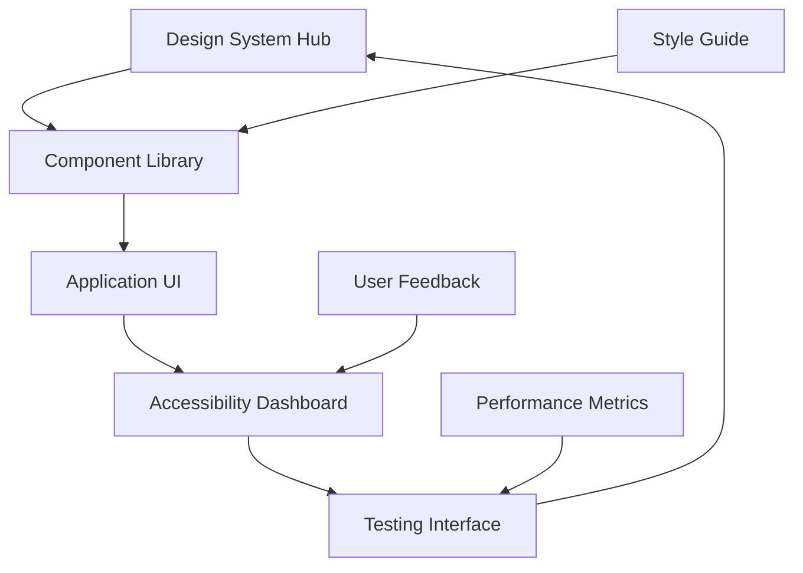

## 1. Product Overview
Modernisasi UI/UX lintas aplikasi untuk meningkatkan kualitas antarmuka pengguna secara menyeluruh. Proyek ini bertujuan untuk menerapkan prinsip desain modern, konsisten, dan intuitif di seluruh aplikasi.

Target: Menciptakan pengalaman pengguna yang superior dengan standar aksesibilitas tinggi dan desain yang responsive untuk desktop dan mobile.

## 2. Core Features

### 2.1 User Roles
| Role | Registration Method | Core Permissions |
|------|---------------------|------------------|
| End User | Aplikasi login | Akses semua fitur UI/UX modern |
| Admin | Admin panel | Kelola design system dan komponen |
| Developer | Development tools | Implementasi dan maintenance komponen |

### 2.2 Feature Module
Aplikasi ini terdiri dari halaman-halaman berikut:

1. **Design System Hub**: Komponen UI, dokumentasi, dan playground untuk testing
2. **Component Library**: Koleksi komponen yang telah dimodernisasi dengan standar aksesibilitas
3. **Accessibility Dashboard**: Monitoring dan pelaporan aksesibilitas aplikasi
4. **Style Guide**: Panduan konsistensi visual dan interaktif
5. **Testing Interface**: Alat untuk pengujian UI/UX dan user flows

### 2.3 Page Details
| Page Name | Module Name | Feature description |
|-----------|-------------|---------------------|
| Design System Hub | Component Showcase | Menampilkan semua komponen UI dalam berbagai state dan varian |
| Design System Hub | Documentation Panel | Menyediakan dokumentasi lengkap untuk setiap komponen |
| Design System Hub | Live Preview | Memungkinkan testing komponen secara real-time |
| Component Library | Modern Components | Koleksi komponen dengan desain modern dan animasi smooth |
| Component Library | Accessibility Features | Komponen dengan ARIA labels dan keyboard navigation |
| Component Library | Responsive Elements | Komponen yang adaptif terhadap berbagai ukuran layar |
| Accessibility Dashboard | Compliance Monitor | Monitoring tingkat kepatuhan terhadap standar aksesibilitas |
| Accessibility Dashboard | Issue Tracker | Pelacakan dan pelaporan masalah aksesibilitas |
| Style Guide | Color Palette | Definisi warna primer, sekunder, dan semantic colors |
| Style Guide | Typography System | Sistem tipografi dengan hierarki yang jelas |
| Style Guide | Spacing & Layout | Standar spacing, grid system, dan layout principles |
| Testing Interface | User Flow Testing | Pengujian alur pengguna secara komprehensif |
| Testing Interface | Performance Metrics | Pengukuran performa UI/UX |
| Testing Interface | Cross-browser Testing | Verifikasi kompatibilitas lintas browser |

## 3. Core Process

### User Flow - Designer/Developer
1. Designer mengakses Design System Hub untuk melihat komponen yang tersedia
2. Developer mengimplementasikan komponen menggunakan Component Library
3. QA melakukan testing di Testing Interface
4. Admin memonitor hasil di Accessibility Dashboard

### User Flow - End User
1. User mengakses aplikasi dengan UI/UX yang telah dimodernisasi
2. Sistem otomatis memuat komponen dengan desain terbaru
3. User mendapatkan pengalaman yang konsisten di seluruh aplikasi
4. Feedback otomatis dikumpulkan untuk iterasi berikutnya

## 4. User Interface Design

### 4.1 Design Style
- **Primary Colors**: Blue modern (#2563EB), dengan gradasi untuk depth
- **Secondary Colors**: Neutral palette (grayscale) dengan accent colors
- **Button Style**: Rounded corners (8px radius), hover states dengan transisi smooth
- **Font**: Inter untuk body text, Poppins untuk headings
- **Layout Style**: Card-based dengan proper whitespace, grid system 12-column
- **Icons**: Heroicons untuk konsistensi, dengan proper sizing (16px, 20px, 24px)
- **Animation**: Subtle transitions (200-300ms), no jarring movements

### 4.2 Page Design Overview
| Page Name | Module Name | UI Elements |
|-----------|-------------|-------------|
| Design System Hub | Component Showcase | Grid layout 3-column, card shadows, smooth hover effects |
| Component Library | Modern Components | Material Design 3 inspired, elevation system, ripple effects |
| Accessibility Dashboard | Compliance Monitor | Progress bars, status indicators, color-coded metrics |
| Style Guide | Color Palette | Color swatches dengan hex codes, contrast ratios |
| Testing Interface | User Flow Testing | Step-by-step wizard, progress indicators |

### 4.3 Responsiveness
- **Desktop-first**: Optimal experience di layar 1440px ke atas
- **Mobile-adaptive**: Breakpoints di 768px dan 480px
- **Touch optimization**: Touch targets minimum 44px, gesture support
- **Performance**: Lazy loading untuk images, code splitting untuk komponen

### 4.4 Accessibility Standards
- **WCAG 2.1 Level AA**: Kepatuhan terhadap semua kriteria
- **Keyboard Navigation**: Full keyboard accessibility
- **Screen Reader Support**: ARIA labels dan proper semantic HTML
- **Color Contrast**: Minimum 4.5:1 untuk normal text, 3:1 untuk large text
- **Focus Indicators**: Visible focus states untuk semua interactive elements