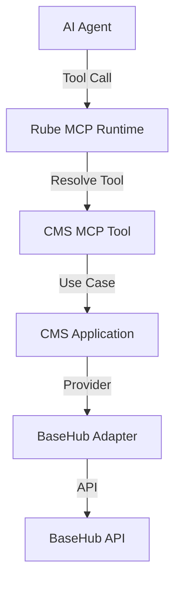

Baik. Berikut **diagram arsitektur CMS ↔ Rube ↔ Agent** yang **final, clean, dan konsisten** dengan SBA-Agentic, MCP, serta monorepo kamu.
Aku sertakan **3 level**: *Conceptual*, *Logical*, dan *Runtime Flow* supaya bisa dipakai untuk **arsitektur, dokumentasi, dan onboarding engineer**.

---

## 1️⃣ Conceptual Architecture (Big Picture)

> Fokus: *peran & boundary*

```
┌───────────────────────────────┐
│        Content Platform        │
│        (packages/cms)          │
│                               │
│  - Structured Content          │
│  - Agent Knowledge             │
│  - Prompt Fragments            │
│  - Policies / Playbooks        │
└───────────────▲───────────────┘
                │
                │ MCP Tools
                │
┌───────────────┴───────────────┐
│        RUBE (MCP Hub)          │
│        packages/rube           │
│                               │
│  - Tool Registry               │
│  - Tool Execution              │
│  - Tenant Context              │
│  - Observability Hooks         │
└───────────────▲───────────────┘
                │
                │ Tool Calls
                │
┌───────────────┴───────────────┐
│        AI AGENTS               │
│  (agentic-reasoning, jobs)     │
│                               │
│  - Planner                     │
│  - Reasoner                    │
│  - Executor                    │
└───────────────────────────────┘
```

📌 **Makna penting**:

* **CMS tidak tahu Agent**
* **Agent tidak tahu BaseHub**
* **Rube adalah satu-satunya pintu integrasi**

---

## 2️⃣ Logical Architecture (Package-Level)

> Fokus: *kode & modul*

```
packages/
├── cms
│   ├── domain
│   │   └── Content, ContentBlock, ContentType
│   ├── application
│   │   ├── GetContent
│   │   ├── ListContent
│   │   └── GetAgentKnowledge
│   ├── infrastructure
│   │   └── basehub
│   │       └── BaseHubProvider
│   └── mcp
│       └── tools
│           ├── getContent.tool.ts
│           ├── searchContent.tool.ts
│           └── getAgentDocs.tool.ts
│
├── rube
│   ├── core
│   │   ├── ToolRegistry
│   │   ├── ToolExecutor
│   │   └── TenantContext
│   ├── adapters
│   │   ├── CmsToolAdapter
│   │   └── AgentToolAdapter
│   └── runtime
│       └── McpRuntime.ts
│
├── agentic-reasoning
│   ├── planner
│   ├── memory
│   ├── reasoning
│   └── execution
```

📌 **Key rules**

* `cms/mcp/*` → **pure MCP schema + handler**
* `rube` → **orchestrator & runtime**
* `agentic-reasoning` → **consumer tools**

---

## 3️⃣ Runtime Flow Diagram (End-to-End)

> Fokus: *apa yang benar-benar terjadi saat agent berjalan*

```
┌───────────────┐
│   User / UI   │
└───────┬───────┘
        │
        │ Request
        ▼
┌─────────────────────┐
│   AI Agent Runner   │
│ (agentic-reasoning) │
└─────────┬───────────┘
          │
          │ "I need policy about invoicing"
          ▼
┌─────────────────────┐
│     RUBE Runtime     │
│  - tool resolution   │
│  - tenant binding    │
│  - audit / tracing   │
└─────────┬───────────┘
          │
          │ call tool: cms.getAgentDocs
          ▼
┌──────────────────────────┐
│   CMS MCP Tool Handler    │
│   (packages/cms/mcp)     │
└─────────┬────────────────┘
          │
          │ use-case execution
          ▼
┌──────────────────────────┐
│ CMS Application Layer     │
│ GetAgentKnowledge         │
└─────────┬────────────────┘
          │
          │ via provider
          ▼
┌──────────────────────────┐
│ BaseHub Provider Adapter  │
│ (infra/basehub)           │
└─────────┬────────────────┘
          │
          ▼
┌──────────────────────────┐
│        BaseHub API        │
└──────────────────────────┘
```

📌 **Observasi penting**

* Agent **tidak fetch CMS langsung**
* Semua lewat **tool contract**
* Tenant, locale, version **dipaksakan oleh Rube**

---

## 4️⃣ MCP Tool Boundary (Detail)

```
┌─────────────────────────────┐
│ MCP Tool: cms.getContent    │
├─────────────────────────────┤
│ Input:                      │
│ - slug                      │
│ - locale                    │
│ - tenantId (injected)       │
│ - preview                   │
├─────────────────────────────┤
│ Output:                     │
│ - structured blocks         │
│ - metadata                  │
│ - version                   │
└─────────────────────────────┘
```

➡️ Output **prompt-safe**, **JSON-structured**, **agent-ready**

---

## 5️⃣ Why This Architecture is Correct (SBA Context)

### ✅ Multi-tenant safe

* Tenant context **dipaksa di Rube**
* CMS tidak bisa bocor data

### ✅ Agent-native

* Konten → knowledge, bukan HTML
* Bisa dipakai untuk:

  * Prompt injection (controlled)
  * Policy grounding
  * Workflow decision

### ✅ Provider-agnostic

* BaseHub bisa diganti
* Tidak mengganggu Agent & Rube

### ✅ Observability ready

* Tool call = event
* Bisa dihubungkan ke:

  * `telemetry`
  * `shared-audit`
  * `analytics`

---

## 6️⃣ Diagram dalam Format Mermaid (siap masuk docs)



---

## 7️⃣ Kesimpulan Final

> **CMS = Knowledge Source**
> **Rube = Control Plane**
> **Agent = Reasoning Engine**

Kalau kamu mau, langkah berikutnya aku bisa:

**diagram observability & audit flow**
**sequence diagram khusus agent reasoning**`.trae/documents/packages-cms/sequence diagram khusus agent reasoning.md`
**README arsitektur CMS ↔ Rube ↔ Agent** siap commit

Tinggal bilang: **lanjut ke mana**.
