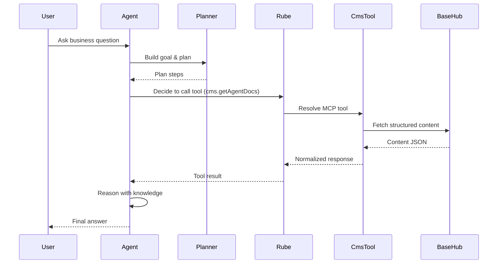

**Sequence Diagram khusus Agent Reasoning** yang **benar-benar agent-native**, konsisten dengan **SBA-Agentic**, **MCP**, **Rube**, dan hasil refactor CMS yang kita sepakati.
Aku bagi menjadi **3 layer sequence**: *Reasoning Loop*, *Tool Interaction*, dan *Failure & Recovery* agar bisa langsung dipakai untuk **arsitektur, dokumentasi, dan validasi desain agent**.

---

# 1️⃣ High-Level Agent Reasoning Loop

> Fokus: *bagaimana agent berpikir*

```
User → Agent → Plan → Reason → Decide → Act → Observe → Repeat
```

Versi sequence detail:

```
┌──────┐      ┌───────────┐
│ User │─────▶│   Agent   │
└──────┘      └─────┬─────┘
                    │
                    ▼
             ┌─────────────┐
             │  Planner     │
             │ (Goal → Plan)│
             └─────┬───────┘
                   │
                   ▼
             ┌─────────────┐
             │ Reasoner     │
             │ (Contextual) │
             └─────┬───────┘
                   │
                   ▼
             ┌─────────────┐
             │ Tool Decide  │
             └─────┬───────┘
                   │
                   ▼
             ┌─────────────┐
             │ Executor     │
             └─────────────┘
```

📌 **Agent tidak langsung call CMS**
📌 **Semua aksi lewat Rube (tool abstraction)**

---

# 2️⃣ Sequence Diagram — Agent ↔ Rube ↔ CMS (Primary Flow)

> Fokus: *knowledge grounding via CMS*

```
User               Agent                Rube              CMS Tool        BaseHub
 |                  |                   |                   |               |
 |  Ask question    |                   |                   |               |
 |----------------->|                   |                   |               |
 |                  | Build Goal        |                   |               |
 |                  |------------------>|                   |               |
 |                  |                   |                   |               |
 |                  | Plan steps        |                   |               |
 |                  |------------------>|                   |               |
 |                  |                   |                   |               |
 |                  | Decide: need doc  |                   |               |
 |                  |------------------>|                   |               |
 |                  |                   | Resolve Tool      |               |
 |                  |                   |------------------>|               |
 |                  |                   |                   | Execute       |
 |                  |                   |                   |-------------->|
 |                  |                   |                   | Fetch content |
 |                  |                   |                   |<--------------|
 |                  |                   |                   | Normalize     |
 |                  |                   |<------------------|               |
 |                  | Receive knowledge |                   |               |
 |                  |------------------>|                   |               |
 |                  | Reason with data  |                   |               |
 |                  |------------------>|                   |               |
 |                  | Generate response |                   |               |
 |<-----------------|                   |                   |               |
```

---

# 3️⃣ Agent Internal Reasoning — Sub-Steps

> Fokus: *apa yang agent lakukan secara internal*

```
┌─────────────────────────────┐
│ Agent Reasoning Context     │
├─────────────────────────────┤
│ - Goal                      │
│ - Tenant Context            │
│ - Conversation State        │
│ - Memory (short/long)       │
│ - Retrieved Knowledge       │
│ - Tool History              │
└──────────────┬──────────────┘
               │
               ▼
┌─────────────────────────────┐
│ Reasoning Step              │
│ - Validate info sufficiency │
│ - Detect ambiguity          │
│ - Decide next action        │
└──────────────┬──────────────┘
               │
               ▼
┌─────────────────────────────┐
│ Action Selection            │
│ - Answer                    │
│ - Ask follow-up             │
│ - Call another tool         │
└─────────────────────────────┘
```

---

# 4️⃣ Failure & Recovery Sequence (Critical)

> Fokus: *agent resilience*

### ❌ CMS Timeout / Error

```
Agent → Rube → CMS Tool
               ✖ timeout
```

Recovery:

```
CMS Tool → Rube (error metadata)
Rube → Agent (structured error)

Agent:
- logs failure
- switches strategy:
  - retry
  - fallback memory
  - partial answer
```

---

### ❌ Inconsistent Knowledge

```
Agent detects:
- outdated version
- conflicting content
```

Then:

```
Agent → Rube → cms.getVersionedContent
```

---

# 5️⃣ Mermaid — Sequence Diagram (Final)

> Bisa langsung masuk ke `docs/architecture/agent-reasoning.md`



---

# 6️⃣ Design Principles Validated

### ✔ Separation of Concerns

* Reasoning ≠ Data fetching
* CMS ≠ Agent logic

### ✔ Deterministic Tool Boundary

* Tool contracts predictable
* Easy audit & replay

### ✔ Agent-First CMS

* Content = **knowledge blocks**
* Not UI-centric

### ✔ Multi-Tenant Safety

* Tenant injected at Rube
* Agent never crafts tenantId manually

---

# 7️⃣ What This Enables Next

Dengan sequence ini kamu siap untuk:

1. **Implement reasoning trace viewer (AG-UI)**
2. **Replay agent decisions (debug mode)**
3. **Policy-aware agents (compliance, audit)**
4. **Tool cost optimization & caching**

---

Kalau kamu mau, langkah berikutnya bisa:

* 🧠 **Reasoning state schema**
* 🧩 **Tool contract schema (Zod)**
* 🖥️ **AG-UI event stream for reasoning**
* 🔍 **Observability & audit sequence**

Tinggal bilang: **lanjut ke mana**.
