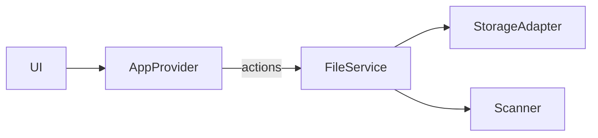

# Context Package — Arsitektur & Integrasi

## Arsitektur
- Provider global: menyatukan `state` dan `actions` untuk konsumsi UI.
- Reducer: aksi `SELECT_FILE`, `ADD_FILE_META`, `SET_ERROR`, `SET_LOADING`.
- Hooks: `useAppContext`, `useAppState`, `useAppActions`.
- Error Boundary: penanganan error UI dengan fallback.

## Integrasi dengan FileService
- `AppProvider` menerima `services.fileService` untuk mengaktifkan `uploadFile`, `downloadFile`, `getPreviewUrl`.
- Sinkronisasi metadata ke `state.files` setelah upload.
- Pola caching: preview URL diutilisasi via FileService; state tidak menyimpan buffer.

## Praktik Terbaik
- Hindari penyimpanan data besar di context.
- Abstraksikan IO ke services.
- Gunakan tipe ketat; validasi input; error taxonomy konsisten.

## Diagram

