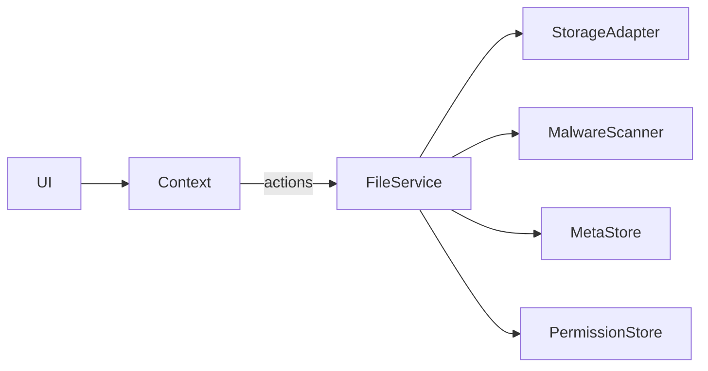

# File Package — Arsitektur & Keamanan

## Arsitektur
- Abstraksi storage via `StorageAdapter` (S3, GCS, memory).
- Malware scanning via `MalwareScanner`.
- Metadata & permission store; preview URL caching.

## Keamanan
- Validasi tipe & ukuran; malware scan; permissions read/write.
- `downloadFileForUser(id, userId)` memverifikasi akses sebelum mengunduh.

## Diagram

