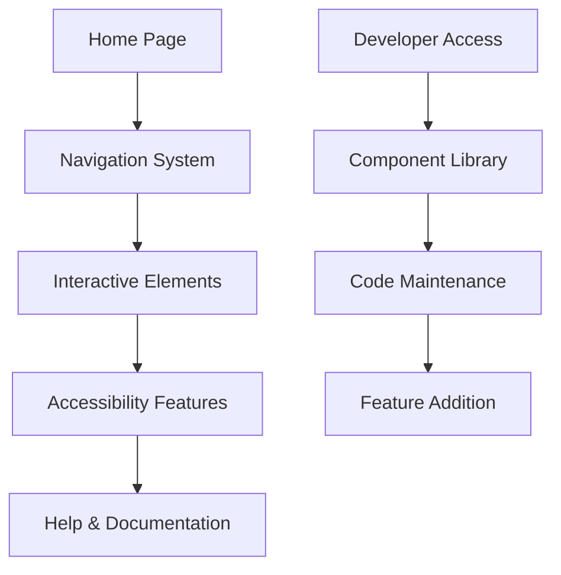

## 1. Product Overview
Proyek ini bertujuan untuk meningkatkan implementasi antarmuka pengguna (UI) dan pengalaman pengguna (UX) melalui refactoring menyeluruh. Proyek ini akan meningkatkan konsistensi visual, aksesibilitas, dan performa aplikasi.

Target utama: Menciptakan aplikasi dengan UI/UX yang konsisten, accessible, dan optimal untuk berbagai perangkat dan browser.

## 2. Core Features

### 2.1 User Roles
| Role | Registration Method | Core Permissions |
|------|---------------------|------------------|
| End User | Aplikasi yang sudah ada | Akses ke seluruh fitur aplikasi |
| Admin/Developer | Internal access | Mengelola dan memelihara sistem |

### 2.2 Feature Module
Proyek refactor UI/UX ini mencakup:
1. **Halaman Utama**: Komponen UI yang telah di-refactor dengan konsistensi visual
2. **Halaman Navigasi**: Menu dan sistem navigasi yang telah dioptimasi
3. **Halaman Interaktif**: Form, tombol, dan elemen interaktif yang telah ditingkatkan
4. **Halaman Bantuan**: Panduan aksesibilitas dan penggunaan aplikasi

### 2.3 Page Details
| Page Name | Module Name | Feature description |
|-----------|-------------|---------------------|
| Home Page | UI Components | Tampilkan komponen-komponen UI yang telah di-refactor dengan konsistensi visual |
| Navigation | Menu System | Navigasi yang intuitif dan accessible dengan keyboard navigation |
| Interactive Elements | Forms & Buttons | Formulir dan tombol dengan validasi real-time dan feedback yang jelas |
| Accessibility Guide | Help Section | Panduan penggunaan fitur aksesibilitas dan keyboard shortcuts |

## 3. Core Process
Proses utama pengguna dalam menggunakan aplikasi yang telah di-refactor:

1. **User Flow Utama**: Pengguna mengakses aplikasi → Menavigasi melalui menu yang telah dioptimasi → Menggunakan fitur interaktif dengan UI yang konsisten → Menerima feedback visual yang jelas

2. **Developer Flow**: Developer mengakses kode → Melakukan maintenance pada komponen yang telah di-refactor → Menambahkan fitur baru dengan mengikuti pedoman konsistensi

## 4. User Interface Design

### 4.1 Design Style
- **Primary Colors**: Warna utama yang konsisten di seluruh aplikasi
- **Secondary Colors**: Warna pendukung untuk status dan feedback
- **Button Style**: Rounded corners dengan hover states yang jelas
- **Typography**: Font yang readable dengan hierarki yang jelas
- **Layout**: Card-based design dengan spacing yang konsisten
- **Icons**: SVG icons dengan ukuran yang standar

### 4.2 Page Design Overview
| Page Name | Module Name | UI Elements |
|-----------|-------------|-------------|
| Home Page | Hero Section | Layout responsif dengan animasi smooth, warna primary #007BFF, font-family: Inter |
| Navigation | Menu Bar | Horizontal navigation dengan dropdown, keyboard accessible, contrast ratio 4.5:1 |
| Forms | Input Fields | Border radius 4px, focus states dengan outline 2px, error states dengan warna merah |
| Buttons | Action Elements | Primary button dengan background gradient, hover effect, disabled state |

### 4.3 Responsiveness
- **Desktop-first approach**: Desain optimal untuk desktop
- **Mobile-adaptive**: Breakpoints untuk tablet (768px) dan mobile (480px)
- **Touch optimization**: Touch targets minimum 44x44px
- **Flexible layouts**: Grid dan flexbox untuk adaptasi kont