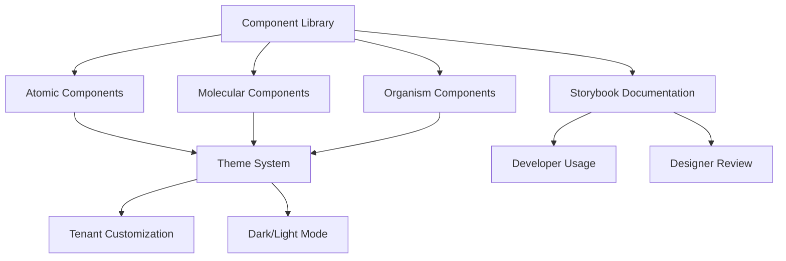

## 1. Product Overview

Refaktor komponen UI untuk SBA-Agentic menggunakan pendekatan atomic design dalam arsitektur monorepo. Tujuan utama adalah menciptakan design system yang modular, maintainable, dan mendukung kebutuhan multi-tenant SaaS dengan theming dinamis.

Produk ini akan digunakan oleh developer internal untuk membangun antarmuka pengguna yang konsisten di seluruh aplikasi SBA-Agentic, dengan kemampuan adaptasi per tenant dan skalabilitas untuk fitur-fitur agentic AI.

## 2. Core Features

### 2.1 User Roles

| Role               | Registration Method   | Core Permissions                                      |
| ------------------ | --------------------- | ----------------------------------------------------- |
| UI Developer       | Internal team member  | Create/modify atomic components, manage design tokens |
| Frontend Developer | Internal team member  | Use components, implement business logic              |
| Product Designer   | Internal team member  | Define design patterns, review component variants     |
| Tenant Admin       | Via tenant onboarding | Customize theme, configure UI preferences             |

### 2.2 Feature Module

Sistem UI requirements terdiri dari komponen berikut:

1. **Atomic Components**: Button, Input, Card, Badge, Avatar, Tooltip, Modal, Dropdown
2. **Molecular Components**: FormField, SearchBar, StatusCard, UserProfile
3. **Organism Components**: Sidebar, Header, DataTable, ChartContainer, AgentPanel
4. **Template Components**: DashboardLayout, AuthLayout, SettingsLayout
5. **Theme System**: Dynamic theming, design tokens, tenant customization

### 2.3 Page Details

| Page Name         | Module Name           | Feature description                                               |
| ----------------- | --------------------- | ----------------------------------------------------------------- |
| Component Library | Atomic Components     | Provide reusable UI elements with consistent styling and behavior |
| Component Library | Molecular Components  | Combine atoms into functional units with specific interactions    |
| Component Library | Organism Components   | Complex components that form distinct sections of interface       |
| Theme Manager     | Design Tokens         | Define and manage color, typography, spacing, and shadow tokens   |
| Theme Manager     | Dynamic Theming       | Enable runtime theme switching and tenant-specific customization  |
| Documentation     | Storybook Integration | Interactive component documentation with usage examples           |
| Documentation     | API Reference         | Complete props documentation and best practices guide             |

## 3. Core Process

### Developer Flow

1. Developer mengakses component library melalui Storybook
2. Memilih komponen yang sesuai dengan kebutuhan
3. Mengimpor komponen dari packages/ui
4. Mengimplementasikan dengan props yang diperlukan
5. Menguji komponen dalam konteks aplikasi

### Designer Flow

1. Designer membuat komponen baru di Figma
2. Mendefinisikan design tokens yang diperlukan
3. Mengusulkan komponen melalui RFC process
4. Review implementasi dengan developer
5. Komponen ditambahkan ke library

### Tenant Customization Flow

1. Tenant mengakses theme settings
2. Memilih warna brand, typography, dan spacing preferences
3. Sistem menyimpan konfigurasi di database
4. Tema diterapkan secara dinamis di frontend
5. Komponen menyesuaikan styling secara otomatis

## 4. User Interface Design

### 4.1 Design Style

* **Primary Colors**: Blue gradient (#3B82F6 to #1E40AF), with tenant customization support

* **Secondary Colors**: Gray scale (slate family), semantic colors (green, red, amber)

* **Button Style**: Rounded corners (8px radius), subtle shadows, hover transitions

* **Typography**: Inter font family, 14px base size, hierarchical scaling (1.25 ratio)

* **Layout Style**: Card-based with consistent spacing (8px grid system)

* **Icon Style**: Heroicons outline style, consistent stroke width

### 4.2 Page Design Overview

| Page Name         | Module Name          | UI Elements                                                                                     |
| ----------------- | -------------------- | ----------------------------------------------------------------------------------------------- |
| Component Library | Atomic Components    | Clean, minimal design with focus on functionality. Each component shows all variants and states |
| Component Library | Molecular Components | Demonstrate component composition with interactive examples                                     |
| Theme Manager     | Design Tokens        | Visual token editor with real-time preview and color picker                                     |
| Theme Manager     | Dynamic Theming      | Toggle switches for light/dark mode, tenant color picker                                        |
| Documentation     | Storybook            | Interactive playground with props controls and code examples                                    |

### 4.3 Responsiveness

* Desktop-first approach with mobile-adaptive breakpoints

* Touch interaction optimization for tablet users

* Responsive spacing scale that adapts to screen size

* Collapsible navigation for mobile devices

