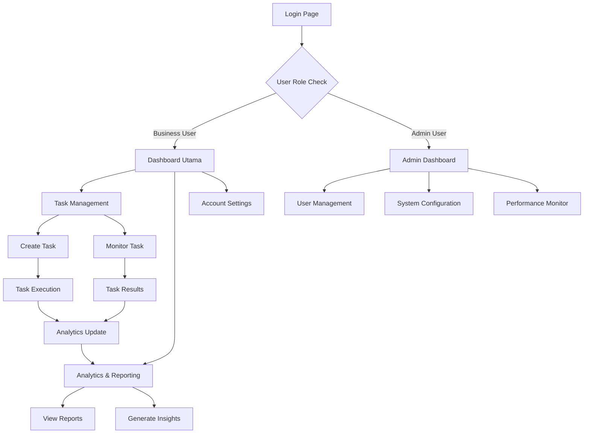

## 1. Product Overview
Platform Smart Business Assistant (SBA) adalah solusi AI-agentik yang menyediakan orkestrasi tugas bisnis otomatis. Proyek ini memerlukan peningkatan menyeluruh pada UI/UX untuk meningkatkan pengalaman pengguna dan penyelesaian fitur-fitur yang sedang dalam pengembangan.

Target utama: Meningkatkan kepuasan pengguna melalui antarmuka yang intuitif, modern, dan responsif, serta memastikan semua fitur berfungsi optimal dengan kualitas tinggi.

## 2. Core Features

### 2.1 User Roles
| Role | Registration Method | Core Permissions |
|------|---------------------|------------------|
| Admin User | Email registration + role assignment | Full system access, user management, system configuration |
| Business User | Email registration | Create and manage business tasks, view analytics, access AI tools |
| Guest User | No registration required | Limited access to demo features, view public content |

### 2.2 Feature Module
Aplikasi ini terdiri dari halaman-halaman berikut:
1. **Dashboard Utama**: Tampilan overview bisnis, metrik kinerja, notifikasi penting.
2. **Manajemen Tugas**: Pembuatan tugas AI, monitoring status, hasil eksekusi.
3. **Analytics & Reporting**: Visualisasi data, laporan kinerja, insight bisnis.
4. **Pengaturan Akun**: Profil pengguna, preferensi, keamanan.
5. **Admin Panel**: Manajemen pengguna, konfigurasi sistem, monitoring performa.

### 2.3 Page Details
| Page Name | Module Name | Feature description |
|-----------|-------------|---------------------|
| Dashboard Utama | Header Navigation | Menyediakan menu navigasi utama dengan akses cepat ke fitur-fitur penting. Mendukung responsive design dan breadcrumbs. |
| Dashboard Utama | Performance Metrics | Menampilkan kartu-kartu metrik utama (KPIs) dengan visualisasi real-time. Mendukung filter berdasarkan waktu dan kategori. |
| Dashboard Utama | Task Overview | Daftar tugas AI aktif dengan status, prioritas, dan progress indicator. Mendukung sorting dan searching. |
| Dashboard Utama | Notification Center | Panel notifikasi dengan badge counter, kategorisasi notifikasi, dan fitur mark as read. |
| Manajemen Tugas | Task Creation Form | Form multi-step untuk membuat tugas AI dengan validasi real-time, template tugas, dan preview. |
| Manajemen Tugas | Task List View | Tabel atau grid view dari semua tugas dengan filtering, sorting, dan bulk actions. |
| Manajemen Tugas | Task Detail View | Halaman detail lengkap untuk setiap tugas termasuk log eksekusi, hasil, dan parameter. |
| Manajemen Tugas | Execution Monitor | Real-time monitoring dari status eksekusi tugas dengan progress bar dan timeline. |
| Analytics & Reporting | Data Visualization | Chart dan grafik interaktif menggunakan library modern (Chart.js/D3.js) dengan export options. |
| Analytics & Reporting | Report Generator | Wizard untuk membuat laporan custom dengan pemilihan metrik, format, dan scheduling. |
| Analytics & Reporting | Insight Engine | Panel rekomendasi AI berdasarkan pola data historis dengan confidence scoring. |
| Pengaturan Akun | Profile Management | Form untuk mengubah informasi profil dengan validasi dan upload foto. |
| Pengaturan Akun | Security Settings | Manajemen password, 2FA, session management, dan audit log aktivitas. |
| Pengaturan Akun | Preferences | Konfigurasi tema, bahasa, timezone, dan notifikasi preferences. |
| Admin Panel | User Management | CRUD operations untuk pengguna dengan role assignment dan bulk operations. |
| Admin Panel | System Configuration | Panel konfigurasi sistem, environment variables, dan feature flags. |
| Admin Panel | Performance Monitor | Dashboard kesehatan sistem dengan metrics performa, error rates, dan uptime. |

## 3. Core Process

### User Flow - Business User
1. **Onboarding**: Login → Dashboard overview → Quick tour/tutorial
2. **Task Creation**: Navigate to Task Management → Create New Task → Configure Parameters → Submit → Monitor Progress
3. **Analytics Review**: Access Analytics → Select Time Range → Review Metrics → Generate Report → Export/Download
4. **Account Management**: Profile Settings → Update Information → Security Check → Save Changes

### Admin Flow
1. **System Setup**: Admin Login → System Configuration → User Management → Permission Setup
2. **Monitoring**: Performance Dashboard → Review Metrics → Identify Issues → Take Action
3. **Maintenance**: System Updates → Backup Management → Log Review → Generate Reports

## 4. User Interface Design

### 4.1 Design Style
**Color Palette:**
- Primary: #3B82F6 (Blue-500) - Untuk elemen utama dan CTA
- Secondary: #10B981 (Emerald-500) - Untuk sukses dan konfirmasi
- Accent: #F59E0B (Amber-500) - Untuk peringatan dan highlight
- Neutral: #6B7280 (Gray-500) - Untuk teks sekunder
- Background: #FFFFFF dan #F9FAFB (Gray-50)

**Typography:**
- Font Family: Inter untuk body, Poppins untuk heading
- Heading: Bold (700), Size: 2.5rem, 2rem, 1.5rem, 1.25rem, 1rem
- Body: Regular (400), Size: 1rem, 0.875rem
- Small Text: 0.75rem untuk label dan helper text

**Component Style:**
- Buttons: Rounded-lg (8px), shadow-sm, hover transitions
- Cards: Rounded-xl (12px), shadow-md, border-gray-200
- Forms: Rounded-md (6px), focus:ring-2, focus:border-blue-500
- Layout: Max-width 7xl, consistent spacing (8px grid system)

**Icons & Imagery:**
- Lucide React untuk ikonsistensi
- Ilustrasi flat design untuk empty states
- Animasi subtle untuk loading dan transitions

### 4.2 Page Design Overview
| Page Name | Module Name | UI Elements |
|-----------|-------------|-------------|
| Dashboard Utama | Header Navigation | Sticky top navigation dengan logo, user menu, notification bell. Background white dengan border-b shadow-sm. |
| Dashboard Utama | Performance Metrics | Grid layout 2x2 untuk desktop, 1x4 untuk mobile. Cards dengan gradient background, animated counters, sparkline charts. |
| Dashboard Utama | Task Overview | Table dengan sticky header, row hover effects, status badges dengan warna kategori, progress bars animasi. |
| Dashboard Utama | Notification Center | Slide-out panel dari kanan, grouped by date, swipe actions untuk mobile, mark all as read button. |
| Manajemen Tugas | Task Creation Form | Multi-step wizard dengan progress indicator, form validation real-time, template preview, drag-drop file upload. |
| Manajemen Tugas | Task List View | Data table dengan column sorting, search bar dengan filter chips, bulk select dengan actions toolbar. |
| Manajemen Tugas | Task Detail View | Two-column layout, left: detail information, right: activity timeline. Sticky action buttons. |
| Manajemen Tugas | Execution Monitor | Real-time progress bar dengan percentage, status indicators dengan animasi pulse, log viewer dengan syntax highlighting. |
| Analytics & Reporting | Data Visualization | Interactive charts dengan tooltip, zoom/pan capabilities, legend interaktif, export dropdown menu. |
| Analytics & Reporting | Report Generator | Step-by-step wizard dengan preview panel, template selection grid, scheduling calendar picker. |
| Analytics & Reporting | Insight Engine | Card-based layout dengan confidence score badges, action buttons untuk setiap rekomendasi, collapsible details. |

### 4.3 Responsiveness
**Desktop-First Approach:**
- Breakpoints: 640px (sm), 768px (md), 1024px (lg), 1280px (xl), 1536px (2xl)
- Layout: Flexible grid system dengan max-width containers
- Navigation: Desktop - horizontal nav, Mobile - hamburger menu dengan slide-out drawer
- Tables: Horizontal scroll pada mobile dengan sticky first column
- Forms: Single column pada mobile, multi-column pada desktop sesuai konteks

**Touch Interaction Optimization:**
- Minimum touch target: 44x44px
- Swipe gestures untuk navigation dan actions
- Pull-to-refresh untuk data update
- Pinch-to-zoom untuk chart dan images

**Performance Considerations:**
- Lazy loading untuk images dan heavy components
- Virtual scrolling untuk large data sets
- Skeleton screens untuk loading states
- Service worker untuk offline functionality