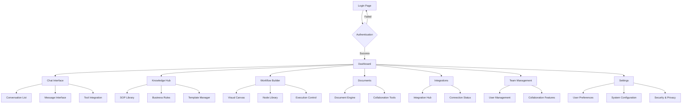

## 1. Product Overview

Smart Business Assistant adalah platform AI-powered yang menyediakan solusi bisnis cerdas dengan antarmuka chat, manajemen pengetahuan, workflow builder, dan integrasi bisnis. Aplikasi ini dirancang untuk membantu pengguna mengoptimalkan proses bisnis melalui asisten AI yang dapat berinteraksi secara natural.

Produk ini menargetkan profesional bisnis dan tim yang membutuhkan alat untuk meningkatkan produktivitas, mengelola pengetahuan perusahaan, dan mengotomasi workflow. Platform ini membantu menyederhanakan pengambilan keputusan dan meningkatkan efisiensi operasional melalui AI yang terintegrasi.

## 2. Core Features

### 2.1 User Roles

| Role | Registration Method | Core Permissions |
|------|---------------------|------------------|
| Admin | Email registration + admin setup | Full access to all features, user management, tenant configuration |
| Team Member | Email invitation from admin | Access to chat, knowledge hub, workflows based on permissions |
| Guest | Limited access invitation | Read-only access to specific shared resources |

### 2.2 Feature Module

Aplikasi Smart Business Assistant terdiri dari fitur utama berikut:

1. **Dashboard**: Overview bisnis, metrik performa, notifikasi, dan quick actions
2. **Chat Interface**: Percakapan AI dengan support multi-turn conversation, tool integration, dan file attachment
3. **Knowledge Hub**: Manajemen pengetahuan perusahaan, SOP library, dan business rules
4. **Workflow Builder**: Visual workflow builder dengan drag-and-drop functionality
5. **Documents**: Manajemen dokumen dengan AI-powered search dan organization
6. **Integrations**: Hub untuk berbagai integrasi bisnis (CRM, ERP, dll)
7. **AI Copilot**: Asisten AI proaktif dengan contextual suggestions
8. **Team Management**: User management, role assignment, dan collaboration tools
9. **Settings**: Konfigurasi aplikasi, preferences, dan system administration

### 2.3 Page Details

| Page Name | Module Name | Feature description |
|-----------|-------------|---------------------|
| Dashboard | Metrics Overview | Menampilkan KPI utama, usage statistics, dan performance indicators dengan grafik interaktif |
| Dashboard | Recent Activity | List aktivitas terbaru dengan filtering dan search capabilities |
| Dashboard | Quick Actions | Tombol akses cepat ke fitur umum dengan customizable shortcuts |
| Dashboard | Alert System | Notifikasi penting dengan severity levels dan dismissible alerts |
| Chat | Conversation List | Sidebar dengan daftar percakapan, search, dan filter by date/status |
| Chat | Message Interface | Multi-turn chat dengan typing indicators, message status, dan real-time updates |
| Chat | Input Controls | Rich text input dengan file attachment, emoji picker, dan voice input |
| Chat | Tool Integration | Execute business tools dalam chat dengan progress indicators |
| Knowledge Hub | SOP Library | Organized SOP collection dengan categorization dan version control |
| Knowledge Hub | Business Rules | Rule engine untuk business logic dengan validation |
| Knowledge Hub | Template Manager | Template creation dan management untuk dokumen umum |
| Workflow Builder | Visual Canvas | Drag-and-drop interface untuk membuat workflow diagrams |
| Workflow Builder | Node Library | Collection of workflow nodes dengan descriptions dan configurations |
| Workflow Builder | Execution Control | Run, pause, dan monitor workflow execution dengan real-time status |
| Documents | Document Engine | Upload, organize, dan search documents dengan AI-powered indexing |
| Documents | Collaboration Tools | Share, comment, dan version control untuk team collaboration |
| Integrations | Integration Hub | Browse, connect, dan configure third-party integrations |
| Integrations | Connection Status | Real-time status monitoring untuk connected services |
| AI Copilot | Contextual Suggestions | AI recommendations berdasarkan current activity dan patterns |
| AI Copilot | Proactive Alerts | Notifikasi predictive insights dan potential issues |
| Team | User Management | Invite, manage roles, dan track team member activity |
| Team | Collaboration Features | Shared workspaces, comments, dan team announcements |
| Settings | User Preferences | Personal settings, theme selection, dan notification preferences |
| Settings | System Configuration | Admin panel untuk tenant-wide settings dan policies |
| Settings | Security & Privacy | MFA setup, session management, dan data privacy controls |

## 3. Core Process

### User Flow - New User Registration
1. User mengakses landing page dan klik "Get Started"
2. Mengisi registration form dengan email, password, dan company details
3. Email verification dikirim untuk konfirmasi akun
4. Setelah verifikasi, user diarahkan ke onboarding wizard
5. User mengkonfigurasi tenant dan invites team members
6. Akses penuh ke dashboard dan fitur utama

### User Flow - Daily Chat Usage
1. User login dan diarahkan ke dashboard
2. Klik menu "Chat" untuk membuka interface percakapan
3. Memilih conversation existing atau memulai conversation baru
4. Mengirim pesan dengan text, attachments, atau voice input
5. AI memproses request dan memberikan response dengan tool integration jika needed
6. User dapat melihat execution status dan hasil dalam real-time
7. Conversation disimpan untuk future reference dan analysis

### User Flow - Workflow Creation
1. User navigasi ke "Workflows" dari sidebar
2. Klik "Create New Workflow" untuk membuka visual builder
3. Drag and drop nodes dari library ke canvas
4. Configure node properties dan connections
5. Test workflow dengan sample data
6. Deploy workflow untuk production use
7. Monitor execution dan performance metrics

## 4. User Interface Design

### 4.1 Design Style

**Color Palette:**
- Primary: #3B82F6 (Blue) - Untuk elemen utama dan CTA
- Secondary: #8B5CF6 (Purple) - Untuk aksen dan highlights
- Success: #10B981 (Green) - Untuk status positive
- Warning: #F59E0B (Amber) - Untuk warnings dan alerts
- Error: #EF4444 (Red) - Untuk errors dan destructive actions
- Background: #FFFFFF / #0F172A (Light/Dark mode)
- Surface: #F8FAFC / #1E293B (Light/Dark mode)

**Typography:**
- Font Family: Inter, system-ui, sans-serif
- Heading: Bold (700) untuk H1-H4
- Body: Regular (400) untuk content utama
- Caption: Medium (500) untuk labels dan small text

**Component Style:**
- Border Radius: 8px untuk consistency
- Shadow: Subtle shadows untuk depth (0 1px 3px rgba(0,0,0,0.1))
- Transitions: 200ms ease-in-out untuk smooth interactions
- Icon Style: Lucide React icons dengan consistent sizing

**Layout Principles:**
- 12-column grid system dengan responsive breakpoints
- Consistent spacing scale (4px, 8px, 16px, 24px, 32px)
- Card-based design untuk content organization
- Clear visual hierarchy dengan proper contrast

### 4.2 Page Design Overview

| Page Name | Module Name | UI Elements |
|-----------|-------------|-------------|
| Dashboard | Metrics Overview | Card layout dengan gradient backgrounds, animated counters, interactive charts menggunakan Chart.js atau Recharts |
| Dashboard | Activity Feed | Timeline component dengan avatar, timestamps, dan status indicators |
| Chat | Conversation List | Collapsible sidebar dengan unread badges, search bar dengan autocomplete, filter dropdown |
| Chat | Message Interface | Bubble-style messages dengan typing indicators, message status icons, timestamp grouping |
| Chat | Input Area | Rich text editor dengan formatting toolbar, file drop zone, voice recording button |
| Knowledge Hub | SOP Grid | Masonry layout untuk SOP cards dengan category tags, progress indicators |
| Workflow Builder | Canvas | SVG-based canvas dengan zoom controls, grid background, connection lines |
| Documents | Document Grid | Card-based layout dengan thumbnail previews, metadata badges, action menus |

### 4.3 Responsiveness

**Desktop-First Approach:**
- Breakpoints: 1920px, 1440px, 1280px, 1024px, 768px, 640px
- Sidebar: Collapsible pada tablet, drawer pada mobile
- Grid Layout: 4-column (mobile), 8-column (tablet), 12-column (desktop)
- Typography: Fluid scaling dengan CSS clamp() function

**Mobile Optimizations:**
- Touch-friendly targets (minimum 44px)
- Swipe gestures untuk navigation
- Optimized keyboard handling
- Reduced motion untuk performance

**Accessibility Features:**
- ARIA labels dan landmarks
- Keyboard navigation support
- Screen reader optimization
- High contrast mode support
- Focus indicators yang jelas
- Skip navigation links

**Performance Considerations:**
- Lazy loading untuk images dan components
- Virtual scrolling untuk long lists
- Code splitting per route
- Optimized bundle sizes
- Progressive enhancement approach