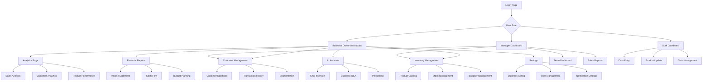

## 1. Product Overview
Smart Business Assistant (sba-agentic) adalah platform AI yang menyediakan asisten bisnis cerdas untuk membantu pengguna dalam mengelola operasional bisnis, analisis data, dan pengambilan keputusan berbasis data. Platform ini dirancang untuk pebisnis, pengusaha UKM, dan profesional yang membutuhkan solusi otomatisasi dan analisis bisnis yang efisien.

Produk ini membantu pengguna mengoptimalkan proses bisnis, mendapatkan insight dari data, dan meningkatkan produktivitas melalui fitur-fitur AI yang terintegrasi. Target pasar adalah bisnis kecil-menengah yang ingin meningkatkan efisiensi operasional dengan teknologi AI.

## 2. Core Features

### 2.1 User Roles
| Role | Registration Method | Core Permissions |
|------|---------------------|------------------|
| Admin User | Email registration with admin approval | Full access to all features, user management, system configuration |
| Business Owner | Email registration | Access to dashboard, analytics, business insights, data management |
| Manager | Invitation from Business Owner | Access to team management, reports, limited analytics |
| Staff Member | Invitation from Manager | Basic access to assigned modules, data entry, view reports |

### 2.2 Feature Module
Smart Business Assistant terdiri dari halaman-halaman utama berikut:
1. **Dashboard**: Overview bisnis, metrik utama, grafik performa, notifikasi penting.
2. **Analytics**: Analisis data penjualan, pelanggan, produk, dan tren bisnis.
3. **Customer Management**: Manajemen data pelanggan, segmentasi, riwayat transaksi.
4. **Inventory Management**: Pengelolaan stok produk, pembelian, supplier, dan peringatan stok.
5. **Sales Tracking**: Pencatatan penjualan, laporan penjualan, performa sales team.
6. **Financial Reports**: Laporan keuangan, cash flow, profit & loss, budget planning.
7. **AI Assistant**: Chatbot AI untuk pertanyaan bisnis, rekomendasi, dan prediksi.
8. **Settings**: Konfigurasi bisnis, manajemen user, preferensi notifikasi.

### 2.3 Page Details
| Page Name | Module Name | Feature description |
|-----------|-------------|---------------------|
| Dashboard | Business Overview | Menampilkan metrik utama seperti total penjualan, jumlah pelanggan, performa bulanan dengan kartu-kartu informasi yang interaktif. |
| Dashboard | Charts & Graphs | Menyajikan visualisasi data dalam bentuk grafik garis, batang, dan pie chart untuk tren penjualan dan pertumbuhan pelanggan. |
| Dashboard | Notifications | Menampilkan notifikasi real-time tentang stok rendah, transaksi penting, dan update sistem. |
| Analytics | Sales Analysis | Menganalisis data penjualan berdasarkan periode, produk, dan kategori dengan filter tanggal yang fleksibel. |
| Analytics | Customer Analytics | Memberikan insight tentang perilaku pelanggan, retention rate, dan lifetime value dengan segmentasi otomatis. |
| Analytics | Product Performance | Menampilkan performa produk berdasarkan penjualan, profit margin, dan popularitas dengan peringkat otomatis. |
| Customer Management | Customer Database | Menyimpan dan mengelola informasi pelanggan lengkap termasuk kontak, alamat, dan preferensi dengan pencarian cepat. |
| Customer Management | Transaction History | Mencatat semua transaksi pelanggan dengan detail produk, jumlah, dan tanggal transaksi yang dapat difilter. |
| Customer Management | Customer Segmentation | Mengelompokkan pelanggan berdasarkan pembelian, frekuensi, dan nilai transaksi untuk target marketing. |
| Inventory Management | Product Catalog | Mengelola katalog produk dengan informasi SKU, deskripsi, harga, dan gambar produk dengan dukungan bulk upload. |
| Inventory Management | Stock Management | Memantau stok real-time, peringatan stok rendah, dan otomatisasi pemesanan ulang dengan threshold yang dapat dikonfigurasi. |
| Inventory Management | Supplier Management | Mengelola informasi supplier, riwayat pembelian, dan performa supplier dengan rating dan review. |
| Sales Tracking | Sales Recording | Mencatat transaksi penjualan dengan detail produk, pelanggan, dan metode pembayaran dengan kalkulasi otomatis. |
| Sales Tracking | Sales Reports | Menghasilkan laporan penjualan harian, mingguan, bulanan dengan export ke PDF dan Excel. |
| Sales Tracking | Sales Team Performance | Memantau performa tim sales dengan target, pencapaian, dan komisi yang terhitung otomatis. |
| Financial Reports | Income Statement | Menyusun laporan laba rugi dengan otomatisasi kalkulasi berdasarkan data penjualan dan biaya operasional. |
| Financial Reports | Cash Flow | Mencatat arus kas masuk dan keluar dengan kategorisasi otomatis dan proyeksi kas. |
| Financial Reports | Budget Planning | Membantu perencanaan anggaran dengan template yang dapat dikustomisasi dan tracking real-time. |
| AI Assistant | Chat Interface | Menyediakan antarmuka chat intuitif untuk berinteraksi dengan AI assistant dengan riwayat percakapan yang tersimpan. |
| AI Assistant | Business Q&A | Menjawab pertanyaan tentang performa bisnis, tren, dan rekomendasi strategi berbasis data historis. |
| AI Assistant | Predictions | Memberikan prediksi penjualan, permintaan produk, dan tren pasar berbasis machine learning. |
| Settings | Business Configuration | Mengatur informasi bisnis, logo, alamat, dan detail perusahaan dengan validasi data. |
| Settings | User Management | Menambah, mengubah, dan menghapus user dengan role-based access control yang fleksibel. |
| Settings | Notification Preferences | Mengkonfigurasi preferensi notifikasi email, SMS, dan in-app dengan template yang dapat dikustomisasi. |

## 3. Core Process

### Business Owner Flow
1. User melakukan registrasi dengan email dan membuat password
2. User login ke sistem dan melengkapi profil bisnis
3. User mengkonfigurasi pengaturan dasar bisnis (nama, alamat, industri)
4. User mengimpor atau memasukkan data produk awal
5. User mulai mencatat transaksi penjualan harian
6. User memantau dashboard untuk overview performa bisnis
7. User menggunakan fitur analytics untuk mendapatkan insight
8. User berinteraksi dengan AI assistant untuk pertanyaan strategis
9. User mengakses laporan keuangan untuk review periodik

### Manager Flow
1. Manager menerima undangan dari Business Owner
2. Manager login dan mengakses menu yang diizinkan
3. Manager melihat dashboard tim dan performa sales
4. Manager mengelola data pelanggan dan staf
5. Manager membuat dan mengekspor laporan untuk Owner

### Staff Flow
1. Staff menerima undangan dari Manager
2. Staff login dan akses modul yang ditugaskan
3. Staff melakukan data entry untuk transaksi
4. Staff memantau stok dan update informasi produk
5. Staff merespon notifikasi tugas yang diberikan

## 4. User Interface Design

### 4.1 Design Style
- **Primary Colors**: Deep Blue (#1E40AF) untuk header dan elemen utama, Electric Blue (#3B82F6) untuk tombol aksi
- **Secondary Colors**: Light Gray (#F3F4F6) untuk background, White (#FFFFFF) untuk kartu dan konten
- **Accent Colors**: Green (#10B981) untuk indikator positif, Red (#EF4444) untuk peringatan, Orange (#F59E0B) untuk perhatian
- **Button Style**: Rounded corners (8px radius), shadow halus, hover effect dengan perubahan warna 10%
- **Typography**: Inter font family, ukuran utama 16px untuk body text, hierarki yang jelas (32px header, 24px subheader, 18px section title)
- **Layout Style**: Card-based design dengan grid system, sidebar navigation yang collapsible, konten utama dengan padding konsisten
- **Icon Style**: Heroicons outline untuk ikonisasi modern dan clean, emoji untuk elemen humanisasi

### 4.2 Page Design Overview
| Page Name | Module Name | UI Elements |
|-----------|-------------|-------------|
| Dashboard | Business Overview | Grid layout 4x2 kartu metrik dengan ikon besar, angka prominent, dan trend indicator dengan arrow icon. Background putih dengan border subtle. |
| Dashboard | Charts & Graphs | Chart container dengan header section, filter dropdown, dan legend. Menggunakan Recharts untuk visualisasi dengan warna yang konsisten. |
| Analytics | Sales Analysis | Tabel interaktif dengan sorting, search bar di atas, filter pills, dan export buttons. Row hover effect dengan background color change. |
| Customer Management | Customer Database | Data table dengan avatar customer, quick action buttons (view, edit, delete), pagination di bawah, dan bulk selection checkbox. |
| Inventory Management | Product Catalog | Card grid layout untuk produk dengan gambar thumbnail, nama produk prominent, harga bold, dan stok indicator dengan color coding. |
| AI Assistant | Chat Interface | Chat bubble design mirip WhatsApp dengan user message di kanan (blue), AI response di kiri (gray), typing indicator, dan input field di bawah. |
| Financial Reports | Income Statement | Tabel keuangan profesional dengan section grouping, subtotal baris, total baris bold, dan percentage calculation di samping angka. |
| Settings | User Management | User list dengan role badges, status indicator (online/offline), action menu dropdown, dan invite user button prominent di atas. |

### 4.3 Responsiveness
- **Desktop-first approach** dengan breakpoint utama: Desktop (1280px+), Tablet (768px-1279px), Mobile (max 767px)
- **Sidebar navigation** otomatis collapse di tablet dan mobile, berubah menjadi hamburger menu
- **Grid layout** menyesuaikan dari 4 kolom (desktop) ke 2 kolom (tablet) ke 1 kolom (mobile)
- **Chart dan tabel** menggunakan horizontal scroll di mobile dengan sticky header
- **Touch interaction** dioptimalkan dengan button size minimum 44px, swipe gesture untuk navigation
- **Font scaling** yang responsif: 16px base di desktop, 15px di tablet, 14px di mobile

### 4.4 3D Scene Guidance
Tidak berlukan untuk produk ini karena fokus pada dashboard dan