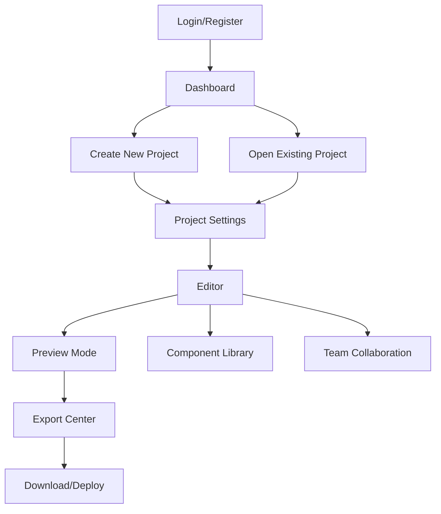

## 1. Product Overview
RANCANGAN apps/app adalah platform digital untuk merancang dan mengelola aplikasi dengan pendekatan visual dan kolaboratif. Produk ini memungkinkan pengguna membuat desain aplikasi, mengelola komponen, dan berkolaborasi dengan tim secara real-time.

Platform ini ditujukan untuk developer, designer, dan product manager yang membutuhkan tools untuk merancang aplikasi secara efisien dengan standar aksesibilitas yang tinggi.

## 2. Core Features

### 2.1 User Roles
| Role | Registration Method | Core Permissions |
|------|---------------------|------------------|
| Free User | Email registration | Bisa membuat maksimal 3 project, export ke format dasar |
| Pro User | Upgrade subscription | Unlimited project, export ke semua format, kolaborasi real-time |
| Enterprise User | Kontak sales | Semua fitur Pro + team management, SSO, priority support |

### 2.2 Feature Module
RANCANGAN apps/app terdiri dari halaman-halaman berikut:
1. **Dashboard**: project list, quick actions, recent activity
2. **Editor**: visual designer, component library, property panel
3. **Project Settings**: project configuration, team management, export options
4. **Component Library**: reusable components, templates, asset management
5. **Preview Mode**: live preview, responsive testing, aksesibilitas checker
6. **Export Center**: multi-format export, code generation, documentation

### 2.3 Page Details
| Page Name | Module Name | Feature description |
|-----------|-------------|---------------------|
| Dashboard | Project List | Tampilkan semua project dengan thumbnail, status, last modified |
| Dashboard | Quick Actions | Buat project baru, import dari template, akses tutorial |
| Dashboard | Recent Activity | Log aktivitas tim, notifikasi perubahan |
| Editor | Visual Designer | Drag-and-drop interface, grid system, alignment tools |
| Editor | Component Library | Sidebar dengan searchable components, favorit system |
| Editor | Property Panel | Edit properties, styling, event handling |
| Editor | Layers Panel | Hierarchy view, locking, visibility toggle |
| Project Settings | Configuration | Project name, description, color scheme, fonts |
| Project Settings | Team Management | Invite members, role assignment, permission settings |
| Project Settings | Export Options | Pilih format export, quality settings, include assets |
| Component Library | Reusable Components | Simpan dan kelola custom components |
| Component Library | Templates | Pre-built templates, kategori, search |
| Component Library | Asset Management | Upload images, icons, fonts, color palettes |
| Preview Mode | Live Preview | Real-time preview dengan hot reload |
| Preview Mode | Responsive Testing | Test di berbagai screen sizes, device presets |
| Preview Mode | Aksesibilitas Checker | WCAG compliance check, contrast ratio, keyboard navigation |
| Export Center | Multi-format Export | HTML/CSS, React, Vue, Flutter, PDF |
| Export Center | Code Generation | Clean code, comments, documentation |
| Export Center | Documentation | Auto-generated docs, API references |

## 3. Core Process

### User Flow - Membuat Project Baru
1. User masuk ke Dashboard
2. Klik "New Project" atau pilih template
3. Masukkan nama project dan konfigurasi dasar
4. Masuk ke Editor untuk mulai mendesain
5. Drag-and-drop components ke canvas
6. Edit properties dan styling
7. Preview hasil di Preview Mode
8. Export project ke format yang diinginkan

### User Flow - Kolaborasi Tim
1. Project owner invite team members
2. Set permissions untuk tiap member
3. Member dapat melihat real-time changes
4. Comment system untuk feedback
5. Version control untuk tracking perubahan

## 4. User Interface Design

### 4.1 Design Style
- **Primary Color**: #2563EB (Blue) - untuk elemen utama dan CTA
- **Secondary Color**: #10B981 (Green) - untuk success states
- **Accent Color**: #F59E0B (Amber) - untuk warning dan highlights
- **Neutral Colors**: Slate palette untuk teks dan background
- **Button Style**: Rounded corners (8px), hover effects, clear states
- **Font**: Inter untuk UI, JetBrains Mono untuk code
- **Layout**: Sidebar + Main Content + Right Panel
- **Icons**: Heroicons untuk konsistensi
- **Spacing**: 8px grid system

### 4.2 Page Design Overview
| Page Name | Module Name | UI Elements |
|-----------|-------------|-------------|
| Dashboard | Header | Logo, search bar, user menu, notifications |
| Dashboard | Project Grid | Card-based layout, hover effects, context menu |
| Dashboard | Sidebar | Quick filters, tags, sorting options |
| Editor | Top Toolbar | Tools, view modes, share button, export |
| Editor | Left Sidebar | Component categories, search, favorites |
| Editor | Main Canvas | Grid overlay, rulers, selection indicators |
| Editor | Right Panel | Properties, layers, asset browser |
| Preview Mode | Device Selector | Dropdown untuk device presets |
| Preview Mode | Toolbar | Refresh, share, fullscreen, aksesibilitas check |
| Export Center | Format Cards | Visual cards untuk tiap format, description |
| Export Center | Settings Panel | Quality, optimization, include options |

### 4.3 Responsiveness
- **Desktop-first approach**: Optimal untuk layar 1440px ke atas
- **Tablet support**: Breakpoint di 768px dan 1024px
- **Mobile support**: Minimal untuk viewing, editing di tablet/desktop
- **Touch optimization**: Touch-friendly controls untuk tablet
- **Keyboard navigation**: Full keyboard support untuk aksesibilitas
- **Screen reader**: ARIA labels dan semantic HTML

## 5. Perubahan Terbaru

### Versi 2.0 (Latest)
- **Aksesibilitas Checker**: Tambahan fitur automated WCAG compliance checking
- **Real-time Collaboration**: Multi-user editing dengan conflict resolution
- **AI Assistant**: AI-powered design suggestions dan component generation
- **Advanced Export**: Support untuk Flutter dan React Native
- **Performance**: 50% faster rendering untuk large projects
- **Dark Mode**: Complete dark theme support
- **Custom Themes**: User dapat membuat dan share custom themes

### Versi 1.5
- **Component Versioning**: Track changes untuk individual components
- **Advanced Animations**: Keyframe animation editor
- **Data Binding**: Connect components ke external data sources
- **Plugin System**: Support untuk third-party plugins

### Versi 1.0
- **Initial Release**: Basic drag-and-drop editor
- **Core Components**: Button, Input, Card, Layout components
- **Export Feature**: HTML/CSS dan React export
- **Team Collaboration**: Basic sharing dan commenting

## 6. Rencana Pengujian

### 6.1 Unit Testing
- **Component Library**: Test untuk 50+ core components
- **Utility Functions**: Test untuk format converters, validators
- **Export Engines**: Test untuk tiap format export
- **Coverage Target**: >80% code coverage

### 6.2 Integration Testing
- **API Integration**: Test Supabase operations
- **Real-time Features**: Test WebSocket connections
- **Export Pipeline**: Test end-to-end export process
- **Third-party Services**: Test AI assistant, external APIs

### 6.3 UI/UX Testing
- **Usability Testing**: 20+ users untuk tiap major release
- **A/B Testing**: Test untuk UI variations, workflow improvements
- **Performance Testing**: Load testing untuk 100+ concurrent users
- **Cross-browser Testing**: Chrome, Firefox, Safari, Edge

### 6.4 Aksesibilitas Testing
- **Automated Scanning**: Axe-core integration untuk setiap page
- **Manual Testing**: Keyboard navigation, screen reader testing
- **Color Contrast**: WCAG AA compliance untuk semua UI elements
- **User Testing**: Testing dengan users yang memiliki disabilities

### 6.5 Security Testing
- **Authentication**: Test OAuth flows, session management
- **Data Validation**: Test input sanitization, SQL injection prevention
- **Export Security**: Test untuk malicious code injection
- **Privacy Compliance**: GDPR, CCPA compliance testing

## 7. Rencana Rollout Verifikasi Aksesibilitas UI/UX

### Fase 1: Development & Internal Testing (2 minggu)
- **Automated Tools**: Implementasi axe-core, Lighthouse CI
- **Component Audit**: Review semua components untuk aksesibilitas
- **Keyboard Navigation**: Pastikan semua interactive elements accessible via keyboard
- **Screen Reader**: Testing dengan NVDA, JAWS, VoiceOver
- **Color Audit**: Verifikasi contrast ratios untuk semua color combinations

### Fase 2: Alpha Testing (1 minggu)
- **Internal Team**: Testing oleh development dan QA team
- **Bug Tracking**: Document dan prioritize aksesibilitas issues
- **Quick Wins**: Implementasi fixes untuk high-impact issues
- **Documentation**: Update component docs dengan aksesibilitas guidelines

### Fase 3: Beta Testing dengan Users (2 minggu)
- **Recruitment**: 10-15 users dengan various disabilities
- **Testing Scenarios**: Buat task-based testing scenarios
- **Feedback Collection**: Surveys, interviews, observational studies
- **Issue Resolution**: Address critical issues sebelum launch

### Fase 4: Pre-launch Verification (1 minggu)
- **Final Audit**: Complete aksesibilitas audit untuk semua features
- **Compliance Check**: WCAG 2.1 Level AA compliance verification
- **Performance**: Pastikan aksesibilitas features tidak impact performance
- **Training**: Training untuk support team tentang aksesibilitas features

### Fase 5: Post-launch Monitoring (Ongoing)
- **User Feedback**: Monitor feedback channels untuk aksesibilitas issues
- **Continuous Improvement**: Regular updates berdasarkan user feedback
- **Compliance Updates**: Stay updated dengan latest WCAG guidelines
- **Feature Enhancement**: Tambahan features untuk better accessibility

### Tools dan Metrics
- **Axe-core**: Automated accessibility scanning
- **Lighthouse**: Performance dan accessibility scoring
- **WAVE**: Web accessibility evaluation tool
- **Color Contrast Analyzers**: Untuk visual design verification
- **Target Metrics**: WCAG 2.1 Level AA compliance, >90 Lighthouse accessibility score