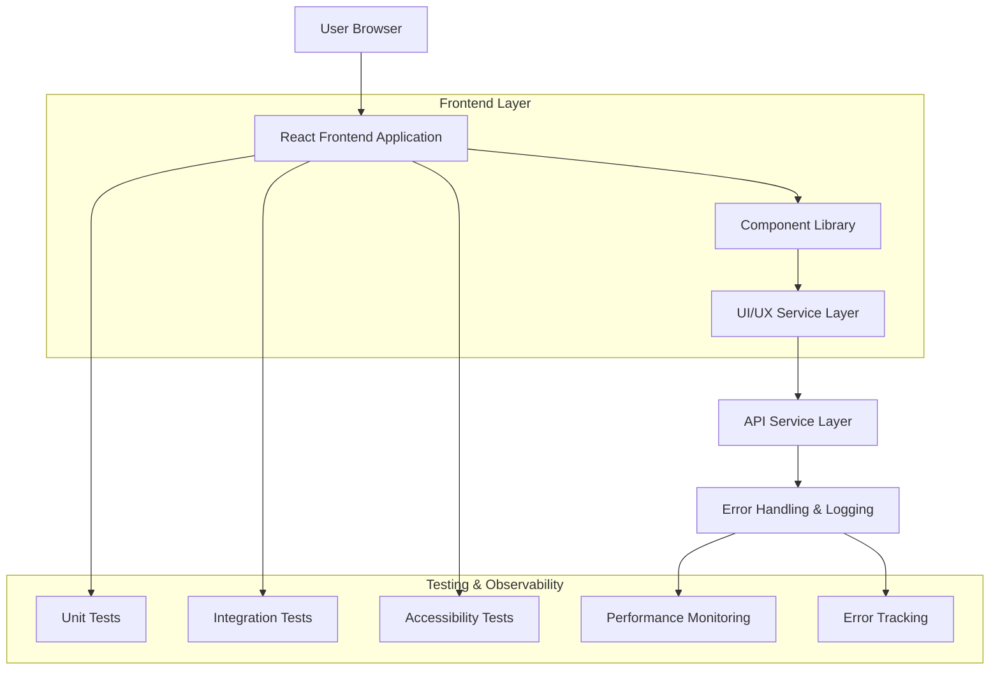
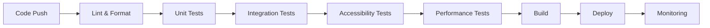

## 1. Architecture design



## 2. Technology Description

* Frontend: React@18 + tailwindcss@3 + vite
* Initialization Tool: vite-init
* Testing: Jest + React Testing Library + Cypress
* Backend: None (Frontend-only refactor)
* Build Tool: Vite with optimization plugins
* Error Handling: RFC7807 Problem Details format (optional)

## 3. Route definitions

| Route | Purpose |
|-------|---------|
| / | Home page, menampilkan komponen UI yang telah di-refactor |
| /components | Component library showcase |
| /accessibility | Panduan aksesibilitas dan testing |
| /performance | Performance metrics dan optimization |
| /api-examples | Contoh implementasi API dan error handling |

## 4. API Response Examples & Error Handling

### 4.1 Response Format Standards

**Success Response Format**
```json
{
  "success": true,
  "data": {
    "components": [
      {
        "id": "button-primary",
        "type": "atom",
        "variant": "primary",
        "accessibility": {
          "ariaLabel": "Primary action button",
          "keyboardSupport": true
        }
      }
    ]
  },
  "message": "Components loaded successfully"
}
```

**Error Response Format (RFC7807 - Optional)**
```json
{
  "type": "https://sba-agentic.com/probs/component-not-found",
  "title": "Component not found",
  "detail": "The requested component 'button-danger' does not exist in the component library",
  "instance": "/api/components/button-danger",
  "status": 404,
  "timestamp": "2025-12-02T10:30:00Z"
}
```

Common HTTP Status Codes:
- `200` - Success
- `201` - Created
- `400` - Bad Request
- `401` - Unauthorized
- `403` - Forbidden
- `404` - Not Found
- `500` - Internal Server Error

### 4.2 Error Handling Patterns

**Frontend Error Boundary**
```typescript
interface ErrorBoundaryState {
  hasError: boolean;
  error: Error | null;
  errorInfo: ErrorInfo | null;
}

class ComponentErrorBoundary extends React.Component<Props, ErrorBoundaryState> {
  static getDerivedStateFromError(error: Error): ErrorBoundaryState {
    return { hasError: true, error, errorInfo: null };
  }
  
  componentDidCatch(error: Error, errorInfo: ErrorInfo) {
    // Log to monitoring service
    console.error('Component error:', error, errorInfo);
  }
}
```

## 5. Testing & Observability

### 5.1 Testing Implementation Examples

**Unit Test Example (Jest + React Testing Library)**
```typescript
describe('Button Component', () => {
  it('renders with correct accessibility attributes', () => {
    render(<Button variant="primary" onClick={jest.fn()}>Click me</Button>);
    
    const button = screen.getByRole('button', { name: 'Click me' });
    expect(button).toBeInTheDocument();
    expect(button).toHaveAttribute('aria-label', 'Click me');
  });
  
  it('handles keyboard navigation correctly', () => {
    const mockClick = jest.fn();
    render(<Button variant="primary" onClick={mockClick}>Test</Button>);
    
    const button = screen.getByRole('button');
    fireEvent.keyDown(button, { key: 'Enter', code: 'Enter' });
    expect(mockClick).toHaveBeenCalledTimes(1);
  });
});
```

**Accessibility Test Example**
```typescript
import { axe, toHaveNoViolations } from 'jest-axe';

expect.extend(toHaveNoViolations);

describe('Component Accessibility', () => {
  it('should have no accessibility violations', async () => {
    const { container } = render(<Button variant="primary">Accessible Button</Button>);
    const results = await axe(container);
    expect(results).toHaveNoViolations();
  });
});
```

### 5.2 Observability & Monitoring

**Performance Monitoring**
```typescript
interface PerformanceMetrics {
  componentRenderTime: number;
  bundleSize: number;
  lighthouseScore: number;
  accessibilityScore: number;
}

class PerformanceMonitor {
  trackComponentMount(componentName: string, renderTime: number) {
    console.log(`${componentName} rendered in ${renderTime}ms`);
    // Send to analytics service
  }
  
  trackUserInteraction(interaction: string, duration: number) {
    console.log(`User interaction '${interaction}' took ${duration}ms`);
  }
}
```

**Error Tracking**
```typescript
interface ErrorTracking {
  error: Error;
  componentStack?: string;
  userAgent: string;
  timestamp: string;
  severity: 'low' | 'medium' | 'high' | 'critical';
}

function trackError(error: Error, severity: ErrorTracking['severity'] = 'medium') {
  const errorInfo: ErrorTracking = {
    error,
    userAgent: navigator.userAgent,
    timestamp: new Date().toISOString(),
    severity
  };
  
  // Send to error tracking service
  console.error('Tracked error:', errorInfo);
}
```

### 5.3 Test Coverage Requirements

| Test Type | Coverage Target | Tools |
|-----------|----------------|--------|
| Unit Tests | ≥ 80% | Jest, React Testing Library |
| Integration Tests | ≥ 70% | Cypress, Playwright |
| Accessibility Tests | 100% (WCAG 2.1 AA) | jest-axe, axe-core |
| Performance Tests | Lighthouse ≥ 90 | Lighthouse CI |
| Cross-browser Tests | Chrome, Firefox, Safari, Edge | BrowserStack |

### 5.4 Monitoring Dashboard Metrics

**Core Web Vitals**
- First Contentful Paint (FCP): < 1.5s
- Largest Contentful Paint (LCP): < 2.5s  
- First Input Delay (FID): < 100ms
- Cumulative Layout Shift (CLS): < 0.1

**Component Performance**
- Average component render time: < 16ms
- Bundle size increase per component: < 5KB
- Memory usage: Stable over time
- Error rate: < 0.1%

## 6. Component Structure

### 6.1 Core Component Types

```typescript
// Base Component Interface
interface BaseComponent {
  id: string;
  className?: string;
  children?: React.ReactNode;
  accessibility?: AccessibilityProps;
}

// Button Component Props
interface ButtonProps extends BaseComponent {
  variant: 'primary' | 'secondary' | 'danger';
  size: 'sm' | 'md' | 'lg';
  disabled?: boolean;
  onClick: () => void;
  loading?: boolean;
}

// Form Component Props
interface FormFieldProps extends BaseComponent {
  label: string;
  error?: string;
  required?: boolean;
  helperText?: string;
}
```

### 6.2 Folder Structure

```
src/
├── components/
│   ├── atoms/
│   │   ├── Button/
│   │   │   ├── Button.tsx
│   │   │   ├── Button.test.tsx
│   │   │   ├── Button.stories.tsx
│   │   │   └── Button.types.ts
│   │   ├── Input/
│   │   └── Typography/
│   ├── molecules/
│   │   ├── FormField/
│   │   ├── Card/
│   │   └── Navigation/
│   └── organisms/
│       ├── Header/
│       ├── Footer/
│       └── Sidebar/
├── hooks/
│   ├── useAccessibility.ts
│   ├── usePerformance.ts
│   ├── useTheme.ts
│   └── useErrorTracking.ts
├── services/
│   ├── api/
│   ├── errorHandling/
│   └── monitoring/
├── styles/
│   ├── globals.css
│   ├── variables.css
│   └── utilities/
├── utils/
│   ├── accessibility.ts
│   ├── performance.ts
│   ├── validation.ts
│   └── errorTracking.ts
└── tests/
    ├── unit/
    ├── integration/
    ├── e2e/
    └── accessibility/
```

## 7. Performance Optimization

### 7.1 Optimization Strategies

* **Code Splitting**: Lazy loading untuk komponen besar
* **Tree Shaking**: Hapus unused code
* **Image Optimization**: WebP format dengan responsive images
* **CSS Optimization**: PurgeCSS untuk menghapus unused styles
* **Bundle Analysis**: Webpack Bundle Analyzer untuk monitoring
* **Error Boundary**: React Error Boundary untuk graceful error handling

### 7.2 Performance Metrics

| Metric | Target | Measurement |
|--------|--------|-------------|
| First Contentful Paint | < 1.5s | Lighthouse |
| Largest Contentful Paint | < 2.5s | Lighthouse |
| Time to Interactive | < 3.5s | Lighthouse |
| Cumulative Layout Shift | < 0.1 | Lighthouse |
| Error Rate | < 0.1% | Sentry/Monitoring |
| Test Coverage | ≥ 80% | Jest |

## 8. Accessibility Standards

### 8.1 WCAG Compliance

* **Keyboard Navigation**: Semua fitur accessible via keyboard
* **Screen Reader Support**: ARIA labels dan semantic HTML
* **Color Contrast**: Minimal 4.5:1 untuk normal text
* **Focus Management**: Visible focus indicators
* **Error Handling**: Clear error messages dan instructions
* **Error Announcements**: Live regions untuk dynamic content

### 8.2 Testing Tools

* axe DevTools untuk automated testing
* NVDA/JAWS untuk screen reader testing
* Keyboard-only navigation testing
* Color contrast analyzer tools
* jest-axe untuk CI/CD integration

## 9. Development Workflow

### 9.1 Code Quality

* ESLint untuk code linting
* Prettier untuk code formatting
* Husky untuk pre-commit hooks
* SonarQube untuk code analysis
* TypeScript untuk type safety

### 9.2 Documentation

* Storybook untuk component documentation
* JSDoc untuk inline documentation
* README files untuk setup instructions
* CHANGELOG untuk version tracking
* Error handling documentation

## 10. Deployment & Monitoring

### 10.1 CI/CD Pipeline



### 10.2 Monitoring Tools

* **Performance**: Lighthouse CI, Web Vitals
* **Errors**: Sentry, LogRocket
* **Analytics**: Google Analytics, Mixpanel
* **Uptime**: Uptime Robot, Pingdom
* **User Feedback**: Hotjar, FullStory