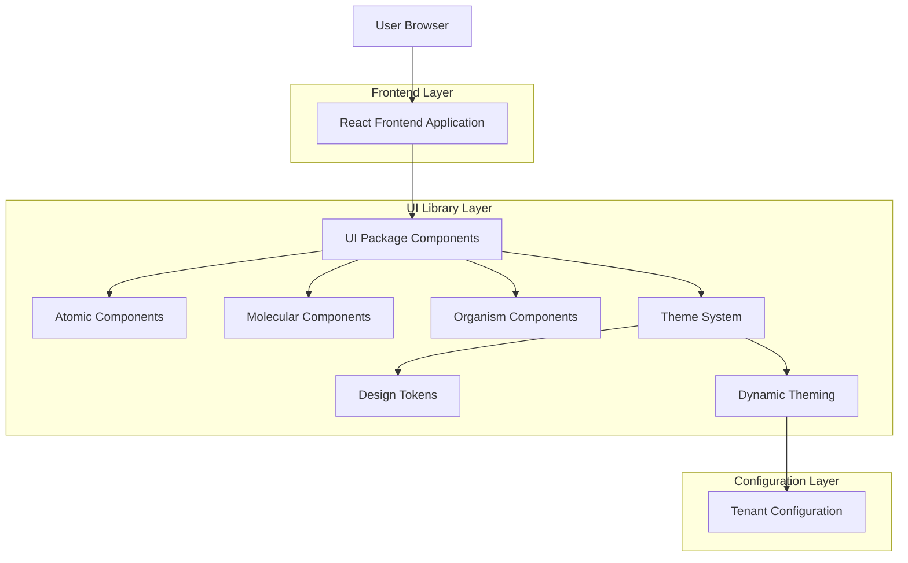
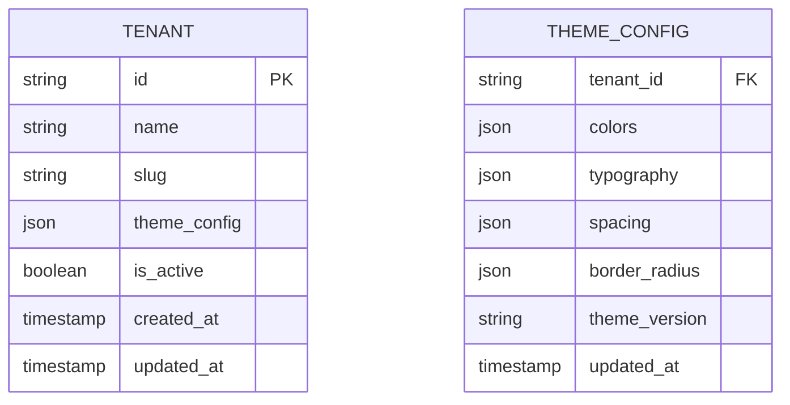

## 1. Architecture Design



## 2. Technology Description
- **Frontend**: React@18 + TypeScript + TailwindCSS@3 + Vite
- **Initialization Tool**: vite-init
- **Component Documentation**: Storybook@7
- **Package Manager**: pnpm (monorepo workspace)
- **Styling**: TailwindCSS with CSS variables for theming
- **Testing**: Vitest + React Testing Library + Storybook Test Runner
- **Backend**: Supabase (for tenant configuration storage)

## 3. Route definitions
| Route | Purpose |
|-------|---------|
| /storybook/* | Component documentation and interactive playground |
| /ui/* | Component showcase and examples |
| /theme/* | Theme configuration and customization interface |

## 4. Component Architecture

### 4.1 Atomic Components API
```typescript
// Button Component
interface ButtonProps {
  variant?: 'primary' | 'secondary' | 'danger' | 'ghost'
  size?: 'sm' | 'md' | 'lg'
  disabled?: boolean
  loading?: boolean
  children: React.ReactNode
  onClick?: () => void
  className?: string
}

// Input Component
interface InputProps {
  type?: 'text' | 'email' | 'password' | 'number'
  placeholder?: string
  value?: string
  onChange?: (value: string) => void
  error?: string
  disabled?: boolean
  className?: string
}
```

### 4.2 Theme System API
```typescript
interface ThemeConfig {
  colors: {
    primary: string
    secondary: string
    success: string
    warning: string
    danger: string
    background: string
    foreground: string
  }
  typography: {
    fontFamily: string
    fontSize: {
      sm: string
      base: string
      lg: string
      xl: string
    }
  }
  spacing: {
    unit: number
    scale: number[]
  }
  borderRadius: {
    sm: string
    md: string
    lg: string
    full: string
  }
}
```

## 5. Package Structure
```
packages/ui/
├── src/
│   ├── atoms/
│   │   ├── Button/
│   │   │   ├── Button.tsx
│   │   │   ├── Button.stories.tsx
│   │   │   ├── Button.test.tsx
│   │   │   └── index.ts
│   │   ├── Input/
│   │   ├── Card/
│   │   └── ...
│   ├── molecules/
│   │   ├── FormField/
│   │   ├── SearchBar/
│   │   └── ...
│   ├── organisms/
│   │   ├── Sidebar/
│   │   ├── Header/
│   │   └── ...
│   ├── templates/
│   │   ├── DashboardLayout/
│   │   └── ...
│   ├── theme/
│   │   ├── ThemeProvider.tsx
│   │   ├── useTheme.ts
│   │   ├── designTokens.ts
│   │   └── ...
│   ├── utils/
│   ├── types/
│   └── index.ts
├── .storybook/
├── package.json
├── tsconfig.json
├── vite.config.ts
└── tailwind.config.ts
```

## 6. Data Model

### 6.1 Tenant Configuration


### 6.2 Data Definition Language
```sql
-- Tenant table
CREATE TABLE tenants (
    id UUID PRIMARY KEY DEFAULT gen_random_uuid(),
    name VARCHAR(255) NOT NULL,
    slug VARCHAR(100) UNIQUE NOT NULL,
    theme_config JSONB DEFAULT '{}',
    is_active BOOLEAN DEFAULT true,
    created_at TIMESTAMP WITH TIME ZONE DEFAULT NOW(),
    updated_at TIMESTAMP WITH TIME ZONE DEFAULT NOW()
);

-- Theme configuration table
CREATE TABLE theme_configs (
    tenant_id UUID PRIMARY KEY REFERENCES tenants(id) ON DELETE CASCADE,
    colors JSONB DEFAULT '{}',
    typography JSONB DEFAULT '{}',
    spacing JSONB DEFAULT '{}',
    border_radius JSONB DEFAULT '{}',
    theme_version VARCHAR(20) DEFAULT 'v1.0',
    updated_at TIMESTAMP WITH TIME ZONE DEFAULT NOW()
);

-- Indexes
CREATE INDEX idx_tenants_slug ON tenants(slug);
CREATE INDEX idx_tenants_active ON tenants(is_active) WHERE is_active = true;
CREATE INDEX idx_theme_configs_tenant ON theme_configs(tenant_id);

-- Row Level Security
ALTER TABLE tenants ENABLE ROW LEVEL SECURITY;
ALTER TABLE theme_configs ENABLE ROW LEVEL SECURITY;

-- Policies
CREATE POLICY "Tenants can be read by authenticated users" ON tenants
    FOR SELECT USING (auth.role() = 'authenticated');

CREATE POLICY "Theme configs can be read by authenticated users" ON theme_configs
    FOR SELECT USING (auth.role() = 'authenticated');

CREATE POLICY "Theme configs can be updated by tenant admins" ON theme_configs
    FOR UPDATE USING (
        auth.role() = 'authenticated' AND 
        tenant_id = (auth.jwt() ->> 'tenant_id')::uuid
    );
```

## 7. Migration Strategy

### Phase 1: Foundation (Week 1-2)
- Setup atomic component structure
- Implement core atoms (Button, Input, Card, etc.)
- Setup Storybook and testing framework
- Create design token system

### Phase 2: Component Library (Week 3-4)
- Build molecular components
- Implement organism components
- Create template layouts
- Setup theme provider and context

### Phase 3: Theming & Multi-tenant (Week 5-6)
- Implement dynamic theming system
- Create tenant configuration API
- Setup theme customization interface
- Test tenant-specific theming

### Phase 4: Integration & Testing (Week 7-8)
- Integrate with existing apps
- Migrate existing components
- Comprehensive testing
- Documentation completion

### Phase 5: Rollout (Week 9-10)
- Gradual migration of existing UI
- Monitor performance and usage
- Gather feedback and iterate
- Training for