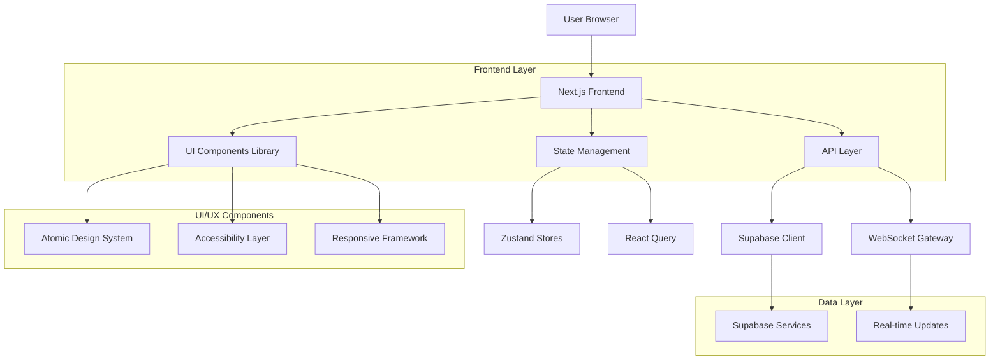
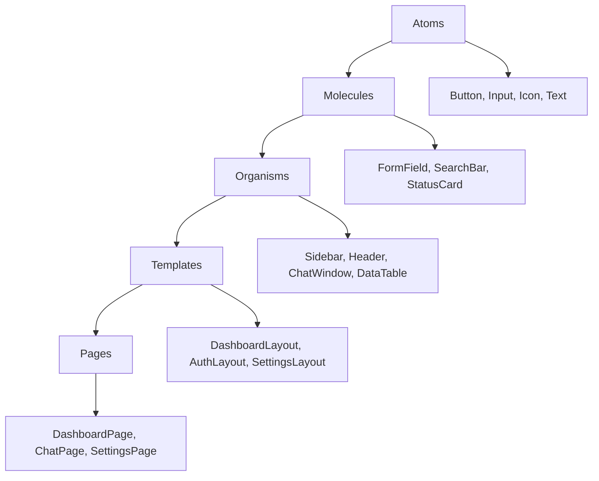

## 1. Architecture Design



## 2. Technology Description

**Frontend Stack:**
- Next.js 14+ dengan App Router untuk optimal performance
- React 18+ dengan Server Components untuk reduced bundle size
- TypeScript 5+ untuk type safety dan developer experience
- Tailwind CSS 3+ untuk utility-first styling
- Framer Motion untuk animations dan micro-interactions

**UI/UX Libraries:**
- Radix UI untuk accessible headless components
- Lucide React untuk consistent iconography
- React Hook Form untuk form handling dengan performance
- Zod untuk schema validation dan type safety
- @tanstack/react-query untuk server state management

**State Management:**
- Zustand untuk client-side state management
- React Query untuk server state dan caching
- Context API untuk theme dan global settings

**Development Tools:**
- Vite untuk fast development dan building
- ESLint + Prettier untuk code quality
- Vitest untuk unit testing dengan TypeScript support
- Playwright untuk end-to-end testing
- Storybook untuk component documentation

**Performance Optimization:**
- Next.js Image component untuk automatic optimization
- Dynamic imports untuk code splitting
- React.memo untuk component memoization
- Virtual scrolling untuk large lists
- Service Worker untuk offline functionality

## 3. Route Definitions

| Route | Purpose | Component | Features |
|-------|---------|-----------|----------|
| / | Landing page | HomePage | Hero section, feature showcase, CTA |
| /dashboard | Main dashboard | DashboardPage | Metrics, activity feed, quick actions |
| /chat | Chat interface | ChatPage | Conversation list, message interface, tools |
| /chat/[id] | Specific conversation | ChatPage | Pre-loaded conversation context |
| /knowledge | Knowledge hub | KnowledgePage | SOP library, business rules, templates |
| /workflows | Workflow builder | WorkflowsPage | Visual canvas, node library, execution |
| /documents | Document management | DocumentsPage | File browser, search, collaboration |
| /integrations | Integration hub | IntegrationsPage | Connection management, status monitoring |
| /ai-copilot | AI assistant | AICopilotPage | Contextual suggestions, proactive alerts |
| /team | Team management | TeamPage | User management, roles, collaboration |
| /settings | User settings | SettingsPage | Preferences, security, configuration |
| /auth/login | Authentication | LoginPage | Email/password, MFA, social login |
| /auth/register | Registration | RegisterPage | User onboarding, company setup |
| /auth/reset | Password reset | ResetPage | Email verification, new password |

## 4. Component Architecture

### 4.1 Atomic Design Structure



### 4.2 Core Components

**Layout Components:**
- `DashboardLayout`: Main application layout dengan sidebar, header, dan content area
- `AuthLayout`: Authentication-focused layout dengan centered forms
- `SettingsLayout`: Settings-specific layout dengan navigation tabs

**Data Display Components:**
- `DataTable`: Sortable, filterable, dan paginated data display
- `MetricCard`: KPI display dengan trend indicators dan sparklines
- `ActivityFeed`: Timeline component untuk recent activity
- `StatusBadge`: Dynamic status indicators dengan color coding

**Form Components:**
- `SmartForm`: Auto-generating forms dari Zod schemas
- `FormField`: Consistent field wrapper dengan error handling
- `FileUpload`: Drag-and-drop file upload dengan progress indicators
- `RichTextEditor`: WYSIWYG editor untuk content creation

**Interactive Components:**
- `ChatWindow`: Message interface dengan real-time updates
- `WorkflowCanvas`: Visual workflow builder dengan drag-and-drop
- `CommandPalette`: Global search dengan keyboard shortcuts
- `NotificationCenter`: Stacked notifications dengan actions

## 5. State Management Architecture

### 5.1 Zustand Store Structure

```typescript
// User Store
interface UserStore {
  user: User | null;
  preferences: UserPreferences;
  setUser: (user: User) => void;
  updatePreferences: (prefs: Partial<UserPreferences>) => void;
}

// UI Store
interface UIStore {
  theme: 'light' | 'dark';
  sidebarCollapsed: boolean;
  activeModal: string | null;
  setTheme: (theme: 'light' | 'dark') => void;
  toggleSidebar: () => void;
  openModal: (modal: string) => void;
  closeModal: () => void;
}

// Chat Store
interface ChatStore {
  conversations: Conversation[];
  activeConversation: Conversation | null;
  isTyping: boolean;
  setActiveConversation: (conv: Conversation) => void;
  addMessage: (message: Message) => void;
  setTyping: (typing: boolean) => void;
}
```

### 5.2 React Query Configuration

```typescript
// Query Client Configuration
const queryClient = new QueryClient({
  defaultOptions: {
    queries: {
      staleTime: 5 * 60 * 1000, // 5 minutes
      cacheTime: 10 * 60 * 1000, // 10 minutes
      retry: 3,
      retryDelay: attemptIndex => Math.min(1000 * 2 ** attemptIndex, 30000),
    },
  },
});

// Query Keys
const QUERY_KEYS = {
  USER: 'user',
  CONVERSATIONS: 'conversations',
  MESSAGES: 'messages',
  METRICS: 'metrics',
  KNOWLEDGE: 'knowledge',
  WORKFLOWS: 'workflows',
  INTEGRATIONS: 'integrations',
} as const;
```

## 6. API Integration

### 6.1 Supabase Integration

```typescript
// Supabase Client Configuration
import { createClient } from '@supabase/supabase-js'

const supabase = createClient(
  process.env.NEXT_PUBLIC_SUPABASE_URL!,
  process.env.NEXT_PUBLIC_SUPABASE_ANON_KEY!
)

// Type-safe database operations
interface Database {
  public: {
    Tables: {
      conversations: {
        Row: Conversation;
        Insert: Omit<Conversation, 'id' | 'created_at'>;
        Update: Partial<Conversation>;
      }
      messages: {
        Row: Message;
        Insert: Omit<Message, 'id' | 'created_at'>;
        Update: Partial<Message>;
      }
    }
  }
}
```

### 6.2 Real-time Subscriptions

```typescript
// Real-time message subscription
const subscribeToMessages = (conversationId: string) => {
  return supabase
    .channel(`messages:${conversationId}`)
    .on('postgres_changes', 
      { event: 'INSERT', schema: 'public', table: 'messages', filter: `conversation_id=eq.${conversationId}` },
      (payload) => {
        queryClient.setQueryData(
          [QUERY_KEYS.MESSAGES, conversationId],
          (old: Message[]) => [...old, payload.new as Message]
        )
      }
    )
    .subscribe()
}
```

## 7. Performance Optimization Strategy

### 7.1 Code Splitting

```typescript
// Dynamic imports untuk large components
const WorkflowCanvas = dynamic(
  () => import('@/components/WorkflowCanvas'),
  { 
    loading: () => <Skeleton className="h-[600px] w-full" />,
    ssr: false 
  }
)

const ChatWindow = dynamic(
  () => import('@/features/chat/components/ChatWindow'),
  {
    loading: () => <ChatSkeleton />
  }
)
```

### 7.2 Image Optimization

```typescript
// Next.js Image component dengan optimization
import Image from 'next/image'

<Image
  src="/hero-illustration.png"
  alt="Smart Business Assistant"
  width={800}
  height={600}
  priority // Load immediately for LCP
  placeholder="blur"
  blurDataURL={generateBlurDataURL()}
/>
```

### 7.3 Virtual Scrolling

```typescript
// Untuk long lists (conversations, messages)
import { FixedSizeList } from 'react-window'

<FixedSizeList
  height={600}
  itemCount={messages.length}
  itemSize={80}
  width="100%"
>
  {({ index, style }) => (
    <div style={style}>
      <MessageItem message={messages[index]} />
    </div>
  )}
</FixedSizeList>
```

## 8. Accessibility Implementation

### 8.1 ARIA Implementation

```typescript
// Semantic HTML dengan proper ARIA labels
<button
  aria-label="Send message"
  aria-pressed={isSending}
  disabled={isSending}
  onClick={handleSend}
>
  {isSending ? 'Sending...' : 'Send'}
</button>

// Live regions untuk dynamic content
<div aria-live="polite" aria-atomic="true">
  {statusMessage && <p>{statusMessage}</p>}
</div>
```

### 8.2 Keyboard Navigation

```typescript
// Custom hook untuk keyboard navigation
const useKeyboardNavigation = () => {
  useEffect(() => {
    const handleKeyDown = (e: KeyboardEvent) => {
      switch (e.key) {
        case 'k' && e.metaKey:
          e.preventDefault()
          openCommandPalette()
          break
        case 'Escape':
          closeActiveModal()
          break
        case 'Tab':
          handleTabNavigation(e)
          break
      }
    }

    document.addEventListener('keydown', handleKeyDown)
    return () => document.removeEventListener('keydown', handleKeyDown)
  }, [])
}
```

## 9. Testing Strategy

### 9.1 Unit Testing

```typescript
// Component testing dengan Vitest
import { render, screen, fireEvent } from '@testing-library/react'
import { describe, it, expect } from 'vitest'

describe('Button Component', () => {
  it('renders with correct text', () => {
    render(<Button>Click me</Button>)
    expect(screen.getByRole('button')).toHaveTextContent('Click me')
  })

  it('handles click events', () => {
    const handleClick = vi.fn()
    render(<Button onClick={handleClick}>Click me</Button>)
    fireEvent.click(screen.getByRole('button'))
    expect(handleClick).toHaveBeenCalledOnce()
  })
})
```

### 9.2 Integration Testing

```typescript
// API integration testing
import { describe, it, expect, beforeEach } from 'vitest'
import { server } from '@/test/mocks/server'
import { rest } from 'msw'

describe('Chat API', () => {
  it('fetches conversations successfully', async () => {
    const conversations = await fetchConversations()
    expect(conversations).toHaveLength(3)
    expect(conversations[0]).toHaveProperty('title')
  })

  it('handles API errors gracefully', async () => {
    server.use(
      rest.get('/api/conversations', (req, res, ctx) => {
        return res(ctx.status(500), ctx.json({ error: 'Server error' }))
      })
    )

    await expect(fetchConversations()).rejects.toThrow('Server error')
  })
})
```

### 9.3 E2E Testing

```typescript
// Playwright E2E tests
import { test, expect } from '@playwright/test'

test('user can send a message', async ({ page }) => {
  await page.goto('/chat')
  await page.fill('[data-testid="message-input"]', 'Hello AI')
  await page.click('[data-testid="send-button"]')
  
  await expect(page.locator('[data-testid="message-list"]')).toContainText('Hello AI')
  await expect(page.locator('[data-testid="ai-response"]')).toBeVisible()
})
```

## 10. Deployment & DevOps

### 10.1 Build Configuration

```typescript
// Next.js configuration untuk optimal build
// next.config.js
module.exports = {
  images: {
    domains: ['supabase.co'],
    formats: ['image/avif', 'image/webp'],
  },
  experimental: {
    optimizeCss: true,
    optimizePackageImports: ['lucide-react'],
  },
  compiler: {
    removeConsole: process.env.NODE_ENV === 'production',
  },
}
```

### 10.2 Environment Variables

```bash
# .env.production
NEXT_PUBLIC_SUPABASE_URL=https://your-project.supabase.co
NEXT_PUBLIC_SUPABASE_ANON_KEY=your-anon-key
NEXT_PUBLIC_APP_URL=https://app.smartbusinessassistant.com
NEXT_PUBLIC_API_URL=https://api.smartbusinessassistant.com

# Analytics dan monitoring
NEXT_PUBLIC_POSTHOG_KEY=your-posthog-key
NEXT_PUBLIC_SENTRY_DSN=your-sentry-dsn
```

### 10.3 Monitoring Setup

```typescript
// Sentry configuration
import * as Sentry from '@sentry/nextjs'

Sentry.init({
  dsn: process.env.NEXT_PUBLIC_SENTRY_DSN,
  environment: process.env.NODE_ENV,
  tracesSampleRate: 0.1,
  beforeSend(event) {
    // Filter sensitive data
    if (event.exception) {
      // Log to external service
    }
    return event
  },
})
```