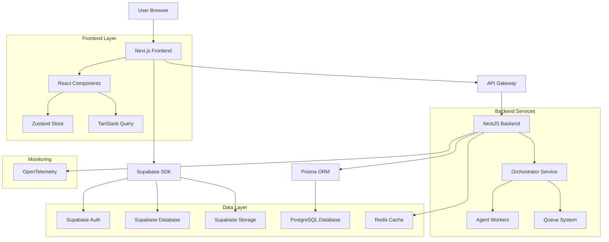
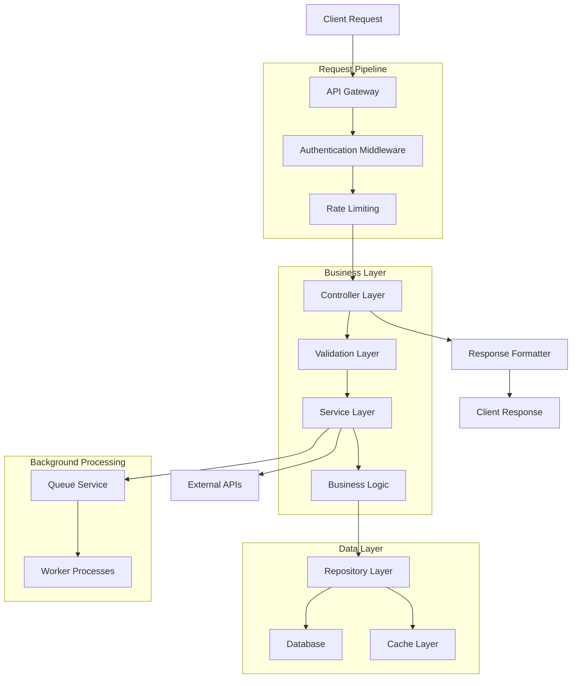
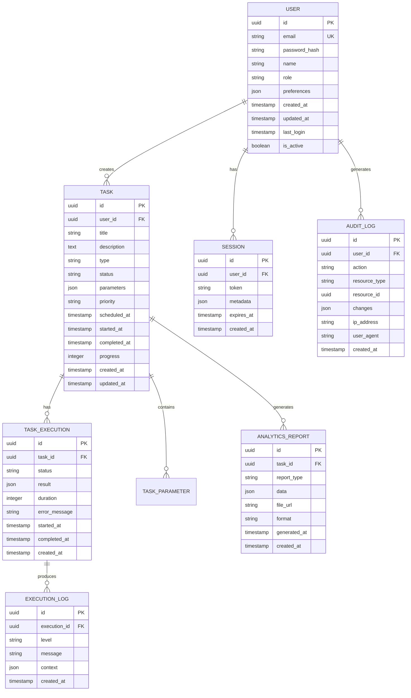

## 1. Architecture Design



## 2. Technology Description

**Frontend Stack:**
- Next.js 14.1.0 dengan React 18.2.0 untuk SSR dan optimalisasi performa
- Tailwind CSS 3.4.0 untuk utility-first styling
- Zustand 5.0.9 untuk state management yang ringan
- TanStack Query 5.17.0 untuk data fetching dan caching
- Lucide React untuk ikonsistensi visual
- TypeScript untuk type safety

**Backend Stack:**
- NestJS 10.3.0 untuk arsitektur modular dan dependency injection
- Express.js 4.18.2 sebagai underlying HTTP server
- Prisma 5.7.0 sebagai ORM dengan type-safe database queries
- PostgreSQL sebagai database utama
- Redis untuk caching dan session management
- BullMQ 5.0.1 untuk job queue dan background processing

**Infrastructure & Services:**
- Supabase untuk authentication, database, dan storage
- Socket.IO untuk real-time communication
- OpenTelemetry untuk observability dan monitoring
- Docker untuk containerization
- Vite untuk development server dan build tooling

**Initialization Tool:**
- create-next-app untuk project scaffolding
- nestjs/cli untuk backend module generation

## 3. Route Definitions

**Frontend Routes (Next.js):**
| Route | Purpose | Layout |
|-------|---------|---------|
| `/` | Landing page dengan hero section dan feature overview | Public Layout |
| `/dashboard` | Main dashboard dengan overview metrik dan quick actions | Authenticated Layout |
| `/tasks` | Task management interface dengan list dan filters | Authenticated Layout |
| `/tasks/new` | Form pembuatan task baru dengan multi-step wizard | Authenticated Layout |
| `/tasks/[id]` | Detail view untuk specific task dengan execution log | Authenticated Layout |
| `/analytics` | Analytics dashboard dengan charts dan reports | Authenticated Layout |
| `/analytics/reports` | Report generation dan management interface | Authenticated Layout |
| `/settings` | User settings dan preferences | Authenticated Layout |
| `/settings/profile` | Profile management dan personal information | Authenticated Layout |
| `/settings/security` | Security settings, 2FA, password management | Authenticated Layout |
| `/admin` | Admin dashboard untuk system management | Admin Layout |
| `/admin/users` | User management interface untuk admin | Admin Layout |
| `/admin/system` | System configuration dan monitoring | Admin Layout |
| `/auth/login` | Login page dengan social auth options | Auth Layout |
| `/auth/register` | Registration page dengan validation | Auth Layout |
| `/auth/forgot-password` | Password recovery interface | Auth Layout |

**API Routes (Backend):**
| Route | Method | Purpose |
|-------|---------|---------|
| `/api/auth/*` | POST/GET | Authentication endpoints (login, logout, refresh) |
| `/api/users/*` | GET/POST/PUT/DELETE | User management CRUD operations |
| `/api/tasks/*` | GET/POST/PUT/DELETE | Task management dan execution |
| `/api/analytics/*` | GET/POST | Analytics data dan report generation |
| `/api/system/*` | GET/POST | System configuration dan health checks |
| `/api/websocket` | WebSocket | Real-time communication channel |

## 4. API Definitions

### 4.1 Authentication API

**Login Endpoint:**
```
POST /api/auth/login
```

Request:
```json
{
  "email": "user@example.com",
  "password": "securePassword123",
  "rememberMe": true
}
```

Response:
```json
{
  "success": true,
  "data": {
    "user": {
      "id": "uuid",
      "email": "user@example.com",
      "name": "John Doe",
      "role": "business_user",
      "avatar": "https://..."
    },
    "tokens": {
      "accessToken": "eyJ...",
      "refreshToken": "eyJ...",
      "expiresIn": 3600
    }
  }
}
```

### 4.2 Task Management API

**Create Task:**
```
POST /api/tasks
```

Request:
```json
{
  "title": "Generate Monthly Report",
  "description": "Create comprehensive monthly business analytics report",
  "type": "analytics_report",
  "parameters": {
    "dateRange": {
      "start": "2024-01-01",
      "end": "2024-01-31"
    },
    "metrics": ["revenue", "users", "conversion"],
    "format": "pdf"
  },
  "priority": "high",
  "scheduledAt": "2024-02-01T09:00:00Z"
}
```

Response:
```json
{
  "success": true,
  "data": {
    "task": {
      "id": "task-uuid",
      "status": "pending",
      "createdAt": "2024-01-31T10:00:00Z",
      "estimatedDuration": 300,
      "progress": 0
    }
  }
}
```

### 4.3 Analytics API

**Get Analytics Data:**
```
GET /api/analytics/metrics?startDate=2024-01-01&endDate=2024-01-31&metrics=revenue,users
```

Response:
```json
{
  "success": true,
  "data": {
    "metrics": {
      "revenue": {
        "total": 125000,
        "trend": "up",
        "change": 15.3,
        "dataPoints": [
          {"date": "2024-01-01", "value": 4000},
          {"date": "2024-01-02", "value": 4200}
        ]
      },
      "users": {
        "total": 5420,
        "trend": "up",
        "change": 8.7,
        "dataPoints": [...]
      }
    },
    "generatedAt": "2024-01-31T10:05:00Z"
  }
}
```

## 5. Server Architecture Diagram



## 6. Data Model

### 6.1 Database Schema



### 6.2 Data Definition Language

```sql
-- Users Table
CREATE TABLE users (
    id UUID PRIMARY KEY DEFAULT gen_random_uuid(),
    email VARCHAR(255) UNIQUE NOT NULL,
    password_hash VARCHAR(255) NOT NULL,
    name VARCHAR(100) NOT NULL,
    role VARCHAR(50) DEFAULT 'business_user' CHECK (role IN ('admin', 'business_user', 'guest')),
    preferences JSONB DEFAULT '{}',
    is_active BOOLEAN DEFAULT true,
    last_login TIMESTAMP WITH TIME ZONE,
    created_at TIMESTAMP WITH TIME ZONE DEFAULT NOW(),
    updated_at TIMESTAMP WITH TIME ZONE DEFAULT NOW()
);

-- Tasks Table
CREATE TABLE tasks (
    id UUID PRIMARY KEY DEFAULT gen_random_uuid(),
    user_id UUID REFERENCES users(id) ON DELETE CASCADE,
    title VARCHAR(255) NOT NULL,
    description TEXT,
    type VARCHAR(50) NOT NULL,
    status VARCHAR(50) DEFAULT 'pending' CHECK (status IN ('pending', 'running', 'completed', 'failed', 'cancelled')),
    parameters JSONB DEFAULT '{}',
    priority VARCHAR(20) DEFAULT 'medium' CHECK (priority IN ('low', 'medium', 'high', 'urgent')),
    progress INTEGER DEFAULT 0 CHECK (progress >= 0 AND progress <= 100),
    scheduled_at TIMESTAMP WITH TIME ZONE,
    started_at TIMESTAMP WITH TIME ZONE,
    completed_at TIMESTAMP WITH TIME ZONE,
    created_at TIMESTAMP WITH TIME ZONE DEFAULT NOW(),
    updated_at TIMESTAMP WITH TIME ZONE DEFAULT NOW()
);

-- Task Executions Table
CREATE TABLE task_executions (
    id UUID PRIMARY KEY DEFAULT gen_random_uuid(),
    task_id UUID REFERENCES tasks(id) ON DELETE CASCADE,
    status VARCHAR(50) NOT NULL CHECK (status IN ('running', 'completed', 'failed', 'cancelled')),
    result JSONB,
    duration INTEGER, -- in seconds
    error_message TEXT,
    started_at TIMESTAMP WITH TIME ZONE,
    completed_at TIMESTAMP WITH TIME ZONE,
    created_at TIMESTAMP WITH TIME ZONE DEFAULT NOW()
);

-- Execution Logs Table
CREATE TABLE execution_logs (
    id UUID PRIMARY KEY DEFAULT gen_random_uuid(),
    execution_id UUID REFERENCES task_executions(id) ON DELETE CASCADE,
    level VARCHAR(20) NOT NULL CHECK (level IN ('debug', 'info', 'warning', 'error', 'critical')),
    message TEXT NOT NULL,
    context JSONB,
    created_at TIMESTAMP WITH TIME ZONE DEFAULT NOW()
);

-- Analytics Reports Table
CREATE TABLE analytics_reports (
    id UUID PRIMARY KEY DEFAULT gen_random_uuid(),
    task_id UUID REFERENCES tasks(id) ON DELETE CASCADE,
    report_type VARCHAR(50) NOT NULL,
    data JSONB NOT NULL,
    file_url VARCHAR(500),
    format VARCHAR(20) DEFAULT 'json' CHECK (format IN ('json', 'pdf', 'csv', 'xlsx')),
    generated_at TIMESTAMP WITH TIME ZONE DEFAULT NOW(),
    created_at TIMESTAMP WITH TIME ZONE DEFAULT NOW()
);

-- Sessions Table
CREATE TABLE sessions (
    id UUID PRIMARY KEY DEFAULT gen_random_uuid(),
    user_id UUID REFERENCES users(id) ON DELETE CASCADE,
    token VARCHAR(500) UNIQUE NOT NULL,
    metadata JSONB DEFAULT '{}',
    expires_at TIMESTAMP WITH TIME ZONE NOT NULL,
    created_at TIMESTAMP WITH TIME ZONE DEFAULT NOW()
);

-- Audit Logs Table
CREATE TABLE audit_logs (
    id UUID PRIMARY KEY DEFAULT gen_random_uuid(),
    user_id UUID REFERENCES users(id) ON DELETE SET NULL,
    action VARCHAR(100) NOT NULL,
    resource_type VARCHAR(50) NOT NULL,
    resource_id UUID,
    changes JSONB,
    ip_address INET,
    user_agent TEXT,
    created_at TIMESTAMP WITH TIME ZONE DEFAULT NOW()
);

-- Indexes for Performance
CREATE INDEX idx_users_email ON users(email);
CREATE INDEX idx_users_role ON users(role);
CREATE INDEX idx_tasks_user_id ON tasks(user_id);
CREATE INDEX idx_tasks_status ON tasks(status);
CREATE INDEX idx_tasks_type ON tasks(type);
CREATE INDEX idx_tasks_priority ON tasks(priority);
CREATE INDEX idx_tasks_created_at ON tasks(created_at DESC);
CREATE INDEX idx_task_executions_task_id ON task_executions(task_id);
CREATE INDEX idx_task_executions_status ON task_executions(status);
CREATE INDEX idx_execution_logs_execution_id ON execution_logs(execution_id);
CREATE INDEX idx_execution_logs_level ON execution_logs(level);
CREATE INDEX idx_execution_logs_created_at ON execution_logs(created_at DESC);
CREATE INDEX idx_sessions_user_id ON sessions(user_id);
CREATE INDEX idx_sessions_token ON sessions(token);
CREATE INDEX idx_sessions_expires_at ON sessions(expires_at);
CREATE INDEX idx_audit_logs_user_id ON audit_logs(user_id);
CREATE INDEX idx_audit_logs_resource ON audit_logs(resource_type, resource_id);
CREATE INDEX idx_audit_logs_created_at ON audit_logs(created_at DESC);

-- Row Level Security (RLS) Policies
ALTER TABLE users ENABLE ROW LEVEL SECURITY;
ALTER TABLE tasks ENABLE ROW LEVEL SECURITY;
ALTER TABLE task_executions ENABLE ROW LEVEL SECURITY;
ALTER TABLE execution_logs ENABLE ROW LEVEL SECURITY;
ALTER TABLE analytics_reports ENABLE ROW LEVEL SECURITY;
ALTER TABLE sessions ENABLE ROW LEVEL SECURITY;
ALTER TABLE audit_logs ENABLE ROW LEVEL SECURITY;

-- RLS Policies
CREATE POLICY "Users can view own profile" ON users FOR SELECT USING (auth.uid() = id);
CREATE POLICY "Users can update own profile" ON users FOR UPDATE USING (auth.uid() = id);
CREATE POLICY "Users can view own tasks" ON tasks FOR SELECT USING (auth.uid() = user_id);
CREATE POLICY "Users can create own tasks" ON tasks FOR INSERT WITH CHECK (auth.uid() = user_id);
CREATE POLICY "Users can update own tasks" ON tasks FOR UPDATE USING (auth.uid() = user_id);
CREATE POLICY "Users can delete own tasks" ON tasks FOR DELETE USING (auth.uid() = user_id);

-- Admin policies
CREATE POLICY "Admins can view all users" ON users FOR SELECT USING (
    EXISTS (
        SELECT 1 FROM users 
        WHERE id = auth.uid() AND role = 'admin'
    )
);

-- Grant permissions
GRANT SELECT ON users TO anon;
GRANT SELECT ON tasks TO anon;
GRANT INSERT ON tasks TO authenticated;
GRANT UPDATE ON tasks TO authenticated;
GRANT DELETE ON tasks TO authenticated;
GRANT SELECT ON task_executions TO authenticated;
GRANT SELECT ON execution_logs TO authenticated;
GRANT SELECT ON analytics_reports TO authenticated;
GRANT ALL ON sessions TO authenticated;
GRANT INSERT ON audit_logs TO authenticated;