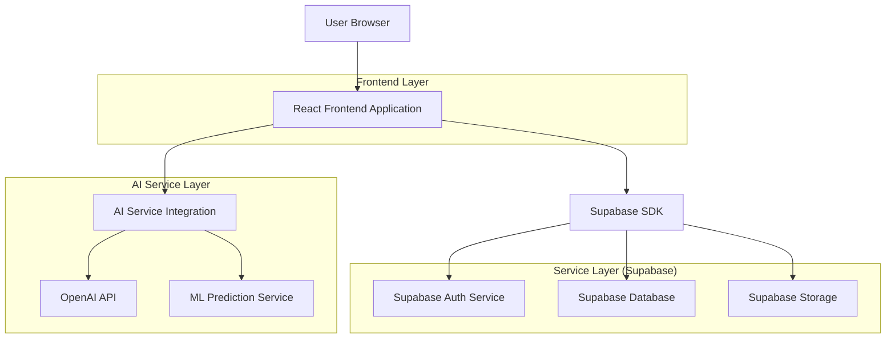
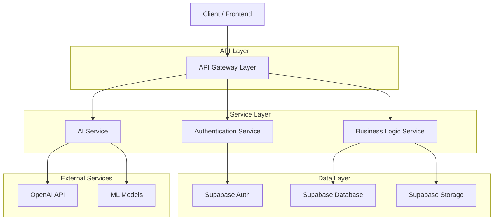
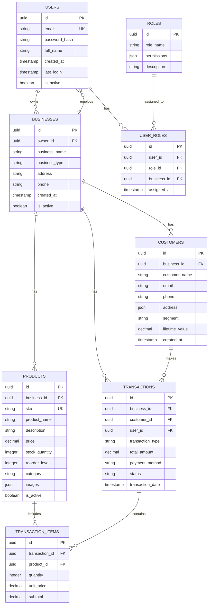

## 1. Architecture design



## 2. Technology Description

- **Frontend**: React@18 + tailwindcss@3 + vite
- **Initialization Tool**: vite-init
- **Backend**: Supabase (BaaS)
- **Database**: PostgreSQL (via Supabase)
- **Authentication**: Supabase Auth
- **Storage**: Supabase Storage
- **AI Integration**: OpenAI API, Custom ML Service
- **Charts**: Recharts@2
- **UI Components**: HeadlessUI + Heroicons
- **State Management**: React Context + useReducer
- **Form Handling**: React Hook Form + Zod validation

## 3. Route definitions

| Route | Purpose |
|-------|---------|
| / | Landing page with product overview and login/register options |
| /login | Authentication page for user login |
| /register | User registration page with business information |
| /dashboard | Main dashboard with business overview and key metrics |
| /analytics | Analytics page with sales, customer, and product analysis |
| /customers | Customer management page with database and segmentation |
| /inventory | Inventory management with product catalog and stock tracking |
| /sales | Sales tracking and recording page |
| /reports | Financial reports including income statement and cash flow |
| /ai-assistant | AI chat interface for business Q&A and predictions |
| /settings | Settings page for business configuration and user management |
| /profile | User profile and account settings |

## 4. API definitions

### 4.1 Authentication APIs

**User Registration**
```
POST /api/auth/register
```

Request:
| Param Name | Param Type | isRequired | Description |
|------------|------------|--------------|-------------|
| email | string | true | User email address |
| password | string | true | User password (min 8 characters) |
| business_name | string | true | Business/company name |
| business_type | string | true | Type of business (retail, service, etc.) |
| phone | string | false | Contact phone number |

Response:
| Param Name | Param Type | Description |
|------------|------------|-------------|
| user_id | string | Unique user identifier |
| email | string | Registered email address |
| role | string | Assigned user role |
| access_token | string | JWT access token |

**User Login**
```
POST /api/auth/login
```

Request:
| Param Name | Param Type | isRequired | Description |
|------------|------------|--------------|-------------|
| email | string | true | User email address |
| password | string | true | User password |

Response:
| Param Name | Param Type | Description |
|------------|------------|-------------|
| user_id | string | Unique user identifier |
| email | string | User email address |
| role | string | User role |
| access_token | string | JWT access token |
| refresh_token | string | Refresh token for session |

### 4.2 Business Data APIs

**Get Dashboard Data**
```
GET /api/dashboard/summary
```

Headers:
- Authorization: Bearer {access_token}

Response:
| Param Name | Param Type | Description |
|------------|------------|-------------|
| total_sales | number | Total sales amount |
| total_customers | number | Total number of customers |
| total_products | number | Total number of products |
| monthly_growth | number | Monthly growth percentage |
| recent_transactions | array | List of recent transactions |

**Get Sales Analytics**
```
GET /api/analytics/sales?start_date={date}&end_date={date}&group_by={day|week|month}
```

Headers:
- Authorization: Bearer {access_token}

Response:
| Param Name | Param Type | Description |
|------------|------------|-------------|
| sales_data | array | Array of sales data points |
| total_revenue | number | Total revenue in period |
| average_order_value | number | Average order value |
| top_products | array | Top performing products |

**Create Customer**
```
POST /api/customers
```

Headers:
- Authorization: Bearer {access_token}

Request:
| Param Name | Param Type | isRequired | Description |
|------------|------------|--------------|-------------|
| name | string | true | Customer full name |
| email | string | false | Customer email |
| phone | string | false | Customer phone |
| address | object | false | Customer address details |
| segment | string | false | Customer segment/category |

**Update Inventory**
```
PUT /api/inventory/products/{product_id}
```

Headers:
- Authorization: Bearer {access_token}

Request:
| Param Name | Param Type | isRequired | Description |
|------------|------------|--------------|-------------|
| stock_quantity | number | false | Updated stock quantity |
| price | number | false | Updated price |
| reorder_level | number | false | Reorder threshold |

### 4.3 AI Assistant APIs

**Chat with AI Assistant**
```
POST /api/ai/chat
```

Headers:
- Authorization: Bearer {access_token}

Request:
| Param Name | Param Type | isRequired | Description |
|------------|------------|--------------|-------------|
| message | string | true | User message/question |
| context | object | false | Business context data |
| chat_history | array | false | Previous chat messages |

Response:
| Param Name | Param Type | Description |
|------------|------------|-------------|
| response | string | AI assistant response |
| confidence | number | Confidence level of response |
| suggested_actions | array | Suggested follow-up actions |

**Get Business Predictions**
```
GET /api/ai/predictions?type={sales|inventory|customer}
```

Headers:
- Authorization: Bearer {access_token}

Response:
| Param Name | Param Type | Description |
|------------|------------|-------------|
| predictions | array | Array of prediction data |
| confidence_interval | object | Confidence interval for predictions |
| factors | array | Key factors influencing predictions |

## 5. Server architecture diagram



## 6. Data model

### 6.1 Data model definition



### 6.2 Data Definition Language

**Users Table**
```sql
-- create table
CREATE TABLE users (
    id UUID PRIMARY KEY DEFAULT gen_random_uuid(),
    email VARCHAR(255) UNIQUE NOT NULL,
    password_hash VARCHAR(255) NOT NULL,
    full_name VARCHAR(100) NOT NULL,
    is_active BOOLEAN DEFAULT true,
    created_at TIMESTAMP WITH TIME ZONE DEFAULT NOW(),
    last_login TIMESTAMP WITH TIME ZONE,
    updated_at TIMESTAMP WITH TIME ZONE DEFAULT NOW()
);

-- create index
CREATE INDEX idx_users_email ON users(email);
CREATE INDEX idx_users_active ON users(is_active);
```

**Businesses Table**
```sql
-- create table
CREATE TABLE businesses (
    id UUID PRIMARY KEY DEFAULT gen_random_uuid(),
    owner_id UUID REFERENCES users(id) ON DELETE CASCADE,
    business_name VARCHAR(255) NOT NULL,
    business_type VARCHAR(50) NOT NULL,
    address JSONB,
    phone VARCHAR(20),
    is_active BOOLEAN DEFAULT true,
    created_at TIMESTAMP WITH TIME ZONE DEFAULT NOW(),
    updated_at TIMESTAMP WITH TIME ZONE DEFAULT NOW()
);

-- create index
CREATE INDEX idx_businesses_owner ON businesses(owner_id);
CREATE INDEX idx_businesses_active ON businesses(is_active);
```

**Customers Table**
```sql
-- create table
CREATE TABLE customers (
    id UUID PRIMARY KEY DEFAULT gen_random_uuid(),
    business_id UUID REFERENCES businesses(id) ON DELETE CASCADE,
    customer_name VARCHAR(255) NOT NULL,
    email VARCHAR(255),
    phone VARCHAR(20),
    address JSONB,
    segment VARCHAR(50) DEFAULT 'regular',
    lifetime_value DECIMAL(12,2) DEFAULT 0,
    created_at TIMESTAMP WITH TIME ZONE DEFAULT NOW(),
    updated_at TIMESTAMP WITH TIME ZONE DEFAULT NOW()
);

-- create index
CREATE INDEX idx_customers_business ON customers(business_id);
CREATE INDEX idx_customers_segment ON customers(segment);
```

**Products Table**
```sql
-- create table
CREATE TABLE products (
    id UUID PRIMARY KEY DEFAULT gen_random_uuid(),
    business_id UUID REFERENCES businesses(id) ON DELETE CASCADE,
    sku VARCHAR(100) UNIQUE NOT NULL,
    product_name VARCHAR(255) NOT NULL,
    description TEXT,
    price DECIMAL(10,2) NOT NULL,
    stock_quantity INTEGER DEFAULT 0,
    reorder_level INTEGER DEFAULT 10,
    category VARCHAR(100),
    images JSONB,
    is_active BOOLEAN DEFAULT true,
    created_at TIMESTAMP WITH TIME ZONE DEFAULT NOW(),
    updated_at TIMESTAMP WITH TIME ZONE DEFAULT NOW()
);

-- create index
CREATE INDEX idx_products_business ON products(business_id);
CREATE INDEX idx_products_sku ON products(sku);
CREATE INDEX idx_products_category ON products(category);
```

**Transactions Table**
```sql
-- create table
CREATE TABLE transactions (
    id UUID PRIMARY KEY DEFAULT gen_random_uuid(),
    business_id UUID REFERENCES businesses(id) ON DELETE CASCADE,
    customer_id UUID REFERENCES customers(id) ON DELETE SET NULL,
    user_id UUID REFERENCES users(id) ON DELETE SET NULL,
    transaction_type VARCHAR(50) NOT NULL,
    total_amount DECIMAL(12,2) NOT NULL,
    payment_method VARCHAR(50),
    status VARCHAR(50) DEFAULT 'completed',
    transaction_date TIMESTAMP WITH TIME ZONE DEFAULT NOW(),
    created_at TIMESTAMP WITH TIME ZONE DEFAULT NOW()
);

-- create index
CREATE INDEX idx_transactions_business ON transactions(business_id);
CREATE INDEX idx_transactions_customer ON transactions(customer_id);
CREATE INDEX idx_transactions_date ON transactions(transaction_date);
```

**Transaction Items Table**
```sql
-- create table
CREATE TABLE transaction_items (
    id UUID PRIMARY KEY DEFAULT gen_random_uuid(),
    transaction_id UUID REFERENCES transactions(id) ON DELETE CASCADE,
    product_id UUID REFERENCES products(id) ON DELETE CASCADE,
    quantity INTEGER NOT NULL,
    unit_price DECIMAL(10,2) NOT NULL,
    subtotal DECIMAL(12,2) NOT NULL,
    created_at TIMESTAMP WITH TIME ZONE DEFAULT NOW()
);

-- create index
CREATE INDEX idx_transaction_items_transaction ON transaction_items(transaction_id);
CREATE INDEX idx_transaction_items_product ON transaction_items(product_id);
```

**Roles and Permissions**
```sql
-- create roles table
CREATE TABLE roles (
    id UUID PRIMARY KEY DEFAULT gen_random_uuid(),
    role_name VARCHAR(50) UNIQUE NOT NULL,
    permissions JSONB,
    description TEXT,
    created_at TIMESTAMP WITH TIME ZONE DEFAULT NOW()
);

-- create user_roles table
CREATE TABLE user_roles (
    id UUID PRIMARY KEY DEFAULT gen_random_uuid(),
    user_id UUID REFERENCES users(id) ON DELETE CASCADE,
    role_id UUID REFERENCES roles(id) ON DELETE CASCADE,
    business_id UUID REFERENCES businesses(id) ON DELETE CASCADE,
    assigned_at TIMESTAMP WITH TIME ZONE DEFAULT NOW(),
    UNIQUE(user_id, role_id, business_id)
);

-- insert default roles
INSERT INTO roles (role_name, permissions, description) VALUES
('admin', '{"all": true}', 'Full system access'),
('owner', '{"dashboard": true, "analytics": true, "customers": true, "products": true, "sales": true, "reports": true, "ai": true, "settings": true}', 'Business owner access'),
('manager', '{"dashboard": true, "analytics": true, "customers": true, "products": true, "sales": true, "reports": true, "ai": false, "settings": false}', 'Manager level access'),
('staff', '{"dashboard": true, "customers": true, "products": true, "sales": true, "reports": false, "ai": false, "settings": false}', 'Staff level access');

-- create indexes
CREATE INDEX idx_user_roles_user ON user_roles(user_id);
CREATE INDEX idx_user_roles_role ON user_roles(role_id);
CREATE INDEX idx_user_roles_business ON user_roles(business_id);
```

**Row Level Security (RLS) Policies**
```sql
-- Enable RLS on all tables
ALTER TABLE businesses ENABLE ROW LEVEL SECURITY;
ALTER TABLE customers ENABLE ROW LEVEL SECURITY;
ALTER TABLE products ENABLE ROW LEVEL SECURITY;
ALTER TABLE transactions ENABLE ROW LEVEL SECURITY;
ALTER TABLE transaction_items ENABLE ROW LEVEL SECURITY;
ALTER TABLE user_roles ENABLE ROW LEVEL SECURITY;

-- Grant basic access to anon role
GRANT SELECT ON businesses TO anon;
GRANT SELECT ON customers TO anon;
GRANT SELECT ON products TO anon;

-- Grant full access to authenticated role
GRANT ALL PRIVILEGES ON ALL TABLES TO authenticated;
GRANT ALL PRIVILEGES ON ALL SEQUENCES TO authenticated;

-- Create RLS policies
CREATE POLICY "Users can view own business" ON businesses
    FOR SELECT USING (auth.uid() = owner_id);

CREATE POLICY "Users can manage own customers" ON customers
    FOR ALL USING (business_id IN (
        SELECT id FROM businesses WHERE owner_id = auth.uid()
    ));

CREATE POLICY "Users can manage own products" ON products
    FOR ALL USING (business_id IN (
        SELECT id FROM businesses WHERE owner_id = auth.uid()
    ));

CREATE POLICY "Users can view own transactions" ON transactions
    FOR ALL USING (business_id IN (
        SELECT id FROM businesses WHERE owner_id = auth.uid()
    ));
```