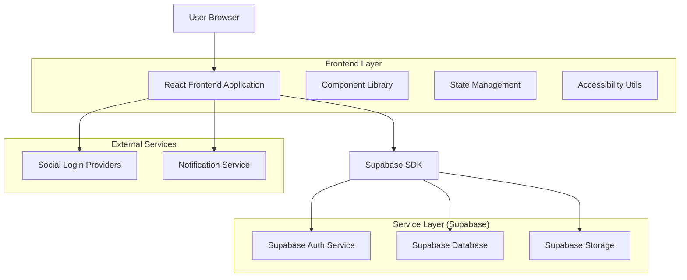
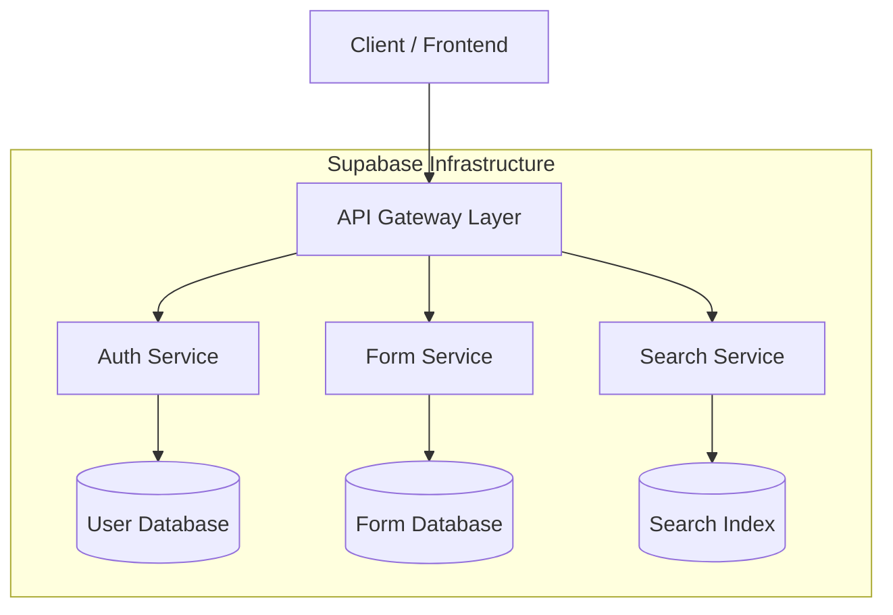
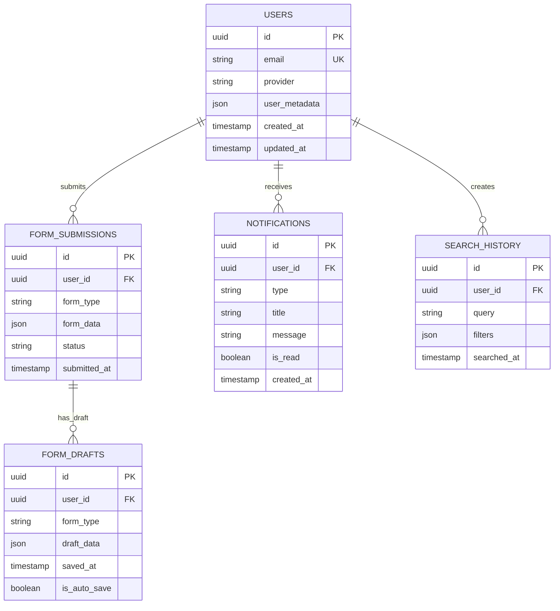

## 1. Architecture Design



## 2. Technology Description
- **Frontend**: React@18 + tailwindcss@3 + vite
- **Initialization Tool**: vite-init
- **Backend**: Supabase (BaaS)
- **UI Component Library**: Headless UI + Radix UI
- **State Management**: React Context + useReducer
- **Form Validation**: React Hook Form + Zod
- **Animation**: Framer Motion
- **Icons**: Heroicons + Lucide React

## 3. Route Definitions
| Route | Purpose |
|-------|---------|
| / | Landing page dengan hero section dan CTA |
| /login | Login page dengan social login integration |
| /register | Registration page dengan form validation |
| /dashboard | User dashboard dengan card-based layout |
| /profile | User profile dan settings management |
| /search | Search interface dengan auto-suggest |
| /forms/:type | Dynamic form pages berdasarkan tipe |
| /notifications | Notification center dan history |
| /admin/* | Admin dashboard dan management |

## 4. API Definitions

### 4.1 Authentication APIs
```
POST /auth/v1/token
```
Request:
| Param Name | Param Type | isRequired | Description |
|------------|------------|------------|-------------|
| email | string | true | User email address |
| password | string | true | User password |
| provider | string | false | Social provider (google, microsoft) |

Response:
| Param Name | Param Type | Description |
|------------|------------|-------------|
| access_token | string | JWT token untuk authentication |
| refresh_token | string | Token untuk refresh session |
| user | object | User data profile |

### 4.2 Form Submission APIs
```
POST /rest/v1/form_submissions
```
Request:
| Param Name | Param Type | isRequired | Description |
|------------|------------|------------|-------------|
| form_type | string | true | Tipe form yang disubmit |
| form_data | object | true | Data form yang sudah divalidasi |
| draft_id | string | false | ID draft untuk auto-save |

Response:
| Param Name | Param Type | Description |
|------------|------------|-------------|
| submission_id | string | Unique ID untuk submission |
| status | string | Status submission (success, error) |
| timestamp | string | Waktu submission |

### 4.3 Search APIs
```
GET /rest/v1/search
```
Request:
| Param Name | Param Type | isRequired | Description |
|------------|------------|------------|-------------|
| query | string | true | Search query string |
| limit | number | false | Limit hasil (default: 10) |
| filters | object | false | Filter parameters |

Response:
| Param Name | Param Type | Description |
|------------|------------|-------------|
| results | array | Array of search results |
| suggestions | array | Auto-suggest items |
| total_count | number | Total jumlah hasil |

## 5. Server Architecture Diagram



## 6. Data Model

### 6.1 Data Model Definition


### 6.2 Data Definition Language

**Users Table**
```sql
-- Create users table
CREATE TABLE users (
    id UUID PRIMARY KEY DEFAULT gen_random_uuid(),
    email VARCHAR(255) UNIQUE NOT NULL,
    provider VARCHAR(50) DEFAULT 'email',
    user_metadata JSONB DEFAULT '{}',
    created_at TIMESTAMP WITH TIME ZONE DEFAULT NOW(),
    updated_at TIMESTAMP WITH TIME ZONE DEFAULT NOW()
);

-- Create indexes
CREATE INDEX idx_users_email ON users(email);
CREATE INDEX idx_users_created_at ON users(created_at DESC);
```

**Form Submissions Table**
```sql
-- Create form submissions table
CREATE TABLE form_submissions (
    id UUID PRIMARY KEY DEFAULT gen_random_uuid(),
    user_id UUID REFERENCES users(id) ON DELETE CASCADE,
    form_type VARCHAR(100) NOT NULL,
    form_data JSONB NOT NULL,
    status VARCHAR(50) DEFAULT 'pending',
    submitted_at TIMESTAMP WITH TIME ZONE DEFAULT NOW()
);

-- Create indexes
CREATE INDEX idx_form_submissions_user_id ON form_submissions(user_id);
CREATE INDEX idx_form_submissions_form_type ON form_submissions(form_type);
CREATE INDEX idx_form_submissions_submitted_at ON form_submissions(submitted_at DESC);
```

**Form Drafts Table**
```sql
-- Create form drafts table
CREATE TABLE form_drafts (
    id UUID PRIMARY KEY DEFAULT gen_random_uuid(),
    user_id UUID REFERENCES users(id) ON DELETE CASCADE,
    form_type VARCHAR(100) NOT NULL,
    draft_data JSONB NOT NULL,
    saved_at TIMESTAMP WITH TIME ZONE DEFAULT NOW(),
    is_auto_save BOOLEAN DEFAULT true
);

-- Create indexes
CREATE INDEX idx_form_drafts_user_id ON form_drafts(user_id);
CREATE INDEX idx_form_drafts_form_type ON form_drafts(form_type);
CREATE INDEX idx_form_drafts_saved_at ON form_drafts(saved_at DESC);
```

**Notifications Table**
```sql
-- Create notifications table
CREATE TABLE notifications (
    id UUID PRIMARY KEY DEFAULT gen_random_uuid(),
    user_id UUID REFERENCES users(id) ON DELETE CASCADE,
    type VARCHAR(50) NOT NULL,
    title VARCHAR(255) NOT NULL,
    message TEXT NOT NULL,
    is_read BOOLEAN DEFAULT false,
    created_at TIMESTAMP WITH TIME ZONE DEFAULT NOW()
);

-- Create indexes
CREATE INDEX idx_notifications_user_id ON notifications(user_id);
CREATE INDEX idx_notifications_is_read ON notifications(is_read);
CREATE INDEX idx_notifications_created_at ON notifications(created_at DESC);
```

**Row Level Security (RLS) Policies**
```sql
-- Enable RLS
ALTER TABLE users ENABLE ROW LEVEL SECURITY;
ALTER TABLE form_submissions ENABLE ROW LEVEL SECURITY;
ALTER TABLE form_drafts ENABLE ROW LEVEL SECURITY;
ALTER TABLE notifications ENABLE ROW LEVEL SECURITY;

-- Grant basic permissions
GRANT SELECT ON users TO anon;
GRANT ALL ON users TO authenticated;
GRANT SELECT ON form_submissions TO anon;
GRANT ALL ON form_submissions TO authenticated;
GRANT SELECT ON form_drafts TO anon;
GRANT ALL ON form_drafts TO authenticated;
GRANT SELECT ON notifications TO anon;
GRANT ALL ON notifications TO authenticated;

-- Create policies
CREATE POLICY "Users can view their own profile" ON users FOR SELECT USING (auth.uid() = id);
CREATE POLICY "Users can update their own profile" ON users FOR UPDATE USING (auth.uid() = id);
CREATE POLICY "Users can view their own submissions" ON form_submissions FOR SELECT USING (auth.uid() = user_id);
CREATE POLICY "Users can create submissions" ON form_submissions FOR INSERT WITH CHECK (auth.uid() = user_id);
CREATE POLICY "Users can view their own drafts" ON form_drafts FOR SELECT USING (auth.uid() = user_id);
CREATE POLICY "Users can manage their own drafts" ON form_drafts FOR ALL USING (auth.uid() = user_id);
CREATE POLICY "Users can view their own notifications" ON notifications FOR SELECT USING (auth.uid() = user_id);
CREATE POLICY "Users can update their own notifications" ON notifications FOR UPDATE USING (auth.uid() = user_id);
```