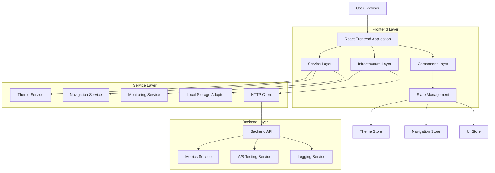
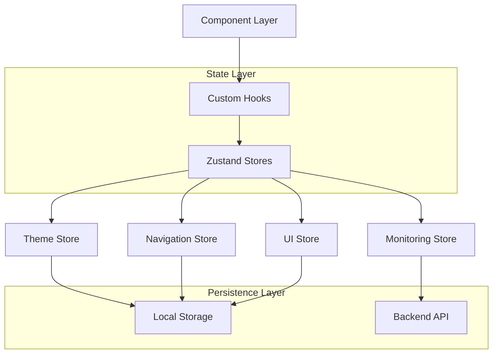
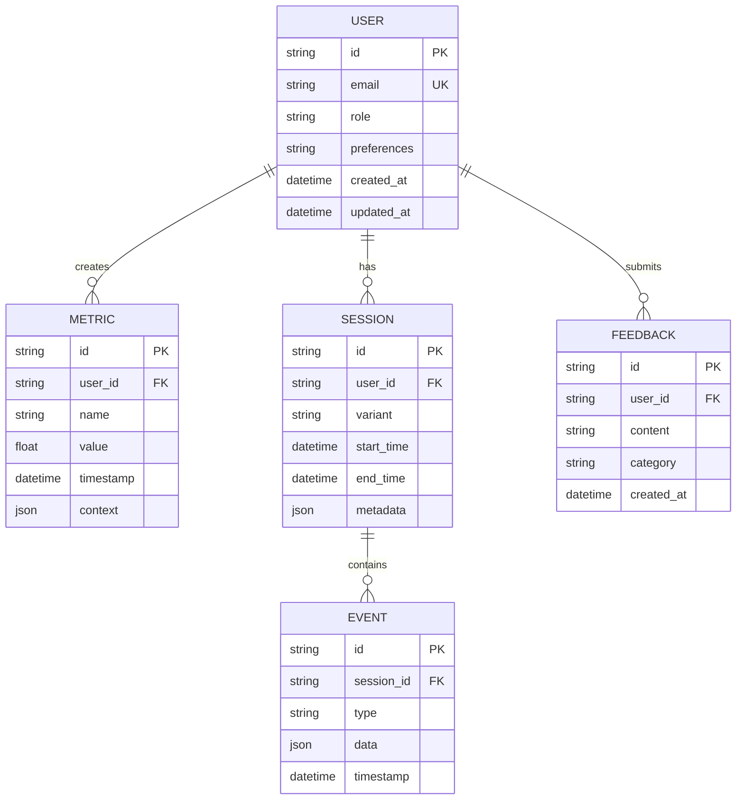

## 1. Architecture Design



## 2. Technology Description

**Frontend Stack:**
- React 18.3.1 + TypeScript untuk component-based architecture
- Tailwind CSS 3.4.17 untuk utility-first styling
- Framer Motion 11.5.6 untuk smooth animations
- Lucide React 0.511.0 untuk consistent iconography
- Radix UI Components untuk accessible primitives
- Vite 6.3.5 sebagai build tool dan dev server

**State Management:**
- Zustand 5.0.9 untuk lightweight state management
- Custom hooks untuk theme dan navigation logic
- Context API untuk dependency injection

**Backend Integration:**
- Express.js 4.21.2 untuk API server
- Better-SQLite3 12.5.0 untuk local data storage
- Knex.js 3.1.0 untuk query builder
- CORS middleware untuk cross-origin requests

**Development Tools:**
- ESLint 9.25.0 dengan React hooks plugin
- Vitest 2.1.4 untuk unit dan integration testing
- MSW 2.12.4 untuk API mocking
- Axe-core 4.8.2 untuk accessibility testing

**Initialization Tool:** vite-init (default untuk React project)

## 3. Route Definitions

| Route | Purpose | Component | Layout |
|-------|---------|-----------|----------|
| `/` | Dashboard utama dengan monitoring dan kontrol | Home.tsx | DashboardLayout |
| `/other` | Halaman alternatif untuk testing navigation | OtherPage.tsx | DashboardLayout |
| `/docs` | Dokumentasi dan readme content | Docs.tsx | DashboardLayout |
| `/settings` | Pengaturan tema dan preferences | Settings.tsx | DashboardLayout |
| `/analytics` | Detail analytics dan reporting | Analytics.tsx | DashboardLayout |
| `/feedback` | User feedback dan bug reporting | Feedback.tsx | DashboardLayout |

## 4. Component Architecture

### 4.1 Core Components Structure
```
src/
├── components/           # Shared UI components
│   ├── ui/            # Base UI components (Button, Card, etc.)
│   ├── layouts/       # Layout components (DashboardLayout, etc.)
│   └── common/        # Common components (Header, Sidebar, etc.)
├── features/          # Feature-based modules
│   ├── header/       # Header functionality
│   ├── sidebar/      # Navigation sidebar
│   ├── theme/        # Theme management
│   └── monitoring/   # Monitoring widgets
├── pages/            # Page components
├── hooks/           # Custom React hooks
├── stores/          # Zustand state stores
├── services/        # Business logic services
├── utils/          # Utility functions
└── types/          # TypeScript type definitions
```

### 4.2 Component Design Patterns

**Compound Components:**
- DashboardLayout dengan Header, Sidebar, Content areas
- DataTable dengan sorting, filtering, pagination
- ThemeProvider dengan mode gelap/terang

**Render Props:**
- Monitoring widgets dengan real-time data
- Search components dengan debounced results

**Custom Hooks:**
- `useTheme()` untuk theme management
- `useNavigation()` untuk menu state
- `useMediaQuery()` untuk responsive behavior
- `useLocalStorage()` untuk persistent preferences

## 5. State Management Architecture



### 5.1 Store Definitions

**Theme Store:**
```typescript
interface ThemeStore {
  mode: 'light' | 'dark' | 'system'
  accentColor: string
  setMode: (mode: ThemeMode) => void
  setAccentColor: (color: string) => void
  toggleMode: () => void
}
```

**Navigation Store:**
```typescript
interface NavigationStore {
  isCollapsed: boolean
  activeItem: string
  searchQuery: string
  toggleSidebar: () => void
  setActiveItem: (id: string) => void
  setSearchQuery: (query: string) => void
}
```

**UI Store:**
```typescript
interface UIStore {
  isLoading: boolean
  notifications: Notification[]
  setLoading: (loading: boolean) => void
  addNotification: (notification: Notification) => void
  removeNotification: (id: string) => void
}
```

## 6. API Integration

### 6.1 Core API Endpoints

**Metrics API:**
```
POST /api/metrics
Content-Type: application/json

{
  "name": "ui_interaction",
  "value": 123.45,
  "ts": 1640995200000,
  "path": "/dashboard",
  "detail": {
    "action": "button_click",
    "element": "variant_a"
  }
}
```

**A/B Testing API:**
```
POST /api/ab/session
Content-Type: application/json

{
  "variant": "A",
  "sessionId": "uuid",
  "timestamp": 1640995200000
}
```

**Logging API:**
```
POST /api/logs
Content-Type: application/json

{
  "level": "info",
  "message": "User feedback submitted",
  "context": {
    "userId": "user123",
    "feedback": "Great UI!",
    "timestamp": 1640995200000
  }
}
```

### 6.2 HTTP Client Configuration

```typescript
interface HttpClientConfig {
  baseURL: string
  timeout: number
  retries: number
  headers: Record<string, string>
}

class HttpClient {
  async get<T>(url: string, config?: RequestConfig): Promise<T>
  async post<T>(url: string, data?: any, config?: RequestConfig): Promise<T>
  async put<T>(url: string, data?: any, config?: RequestConfig): Promise<T>
  async delete<T>(url: string, config?: RequestConfig): Promise<T>
}
```

## 7. Data Model

### 7.1 Database Schema



### 7.2 Data Definition Language

**Users Table:**
```sql
CREATE TABLE users (
    id TEXT PRIMARY KEY,
    email TEXT UNIQUE NOT NULL,
    role TEXT CHECK(role IN ('developer', 'pm', 'qa', 'admin')) DEFAULT 'developer',
    preferences TEXT DEFAULT '{}',
    created_at DATETIME DEFAULT CURRENT_TIMESTAMP,
    updated_at DATETIME DEFAULT CURRENT_TIMESTAMP
);
```

**Metrics Table:**
```sql
CREATE TABLE metrics (
    id TEXT PRIMARY KEY,
    user_id TEXT REFERENCES users(id),
    name TEXT NOT NULL,
    value REAL NOT NULL,
    timestamp DATETIME DEFAULT CURRENT_TIMESTAMP,
    context TEXT DEFAULT '{}'
);

CREATE INDEX idx_metrics_user_timestamp ON metrics(user_id, timestamp);
CREATE INDEX idx_metrics_name ON metrics(name);
```

**Sessions Table:**
```sql
CREATE TABLE sessions (
    id TEXT PRIMARY KEY,
    user_id TEXT REFERENCES users(id),
    variant TEXT CHECK(variant IN ('A', 'B')),
    start_time DATETIME DEFAULT CURRENT_TIMESTAMP,
    end_time DATETIME,
    metadata TEXT DEFAULT '{}'
);
```

## 8. Performance Optimization

### 8.1 Code Splitting
- Lazy loading untuk route-based code splitting
- Component-level code splitting untuk heavy components
- Dynamic imports untuk monitoring widgets

### 8.2 Asset Optimization
- Image optimization dengan WebP format
- SVG sprites untuk ikon
- Font subsetting untuk custom fonts
- Service worker untuk caching strategi

### 8.3 Runtime Performance
- Virtual scrolling untuk large data tables
- Debouncing untuk search inputs
- Memoization untuk expensive computations
- Request batching untuk API calls

## 9. Testing Strategy

### 9.1 Unit Testing
- Component testing dengan React Testing Library
- Hook testing dengan renderHook
- Service testing dengan mocked dependencies
- Utilities testing dengan edge cases

### 9.2 Integration Testing
- API integration testing dengan MSW
- State management testing dengan Zustand
- End-to-end testing untuk critical user flows
- Accessibility testing dengan axe-core

### 9.3 Performance Testing
- Lighthouse CI untuk performance regression
- Bundle size monitoring dengan size-limit
- Runtime performance profiling
- Memory leak detection

## 10. Security Considerations

### 10.1 Frontend Security
- XSS protection dengan proper sanitization
- CSRF protection untuk state-changing operations
- Input validation pada form submissions
- Secure storage untuk sensitive data

### 10.2 API Security
- Rate limiting untuk API endpoints
- Authentication middleware
- Authorization checks per role
- Audit logging untuk security events